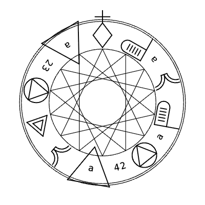
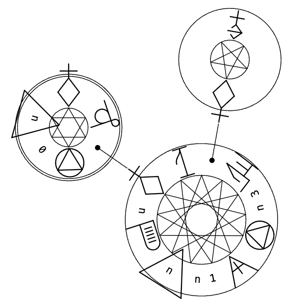
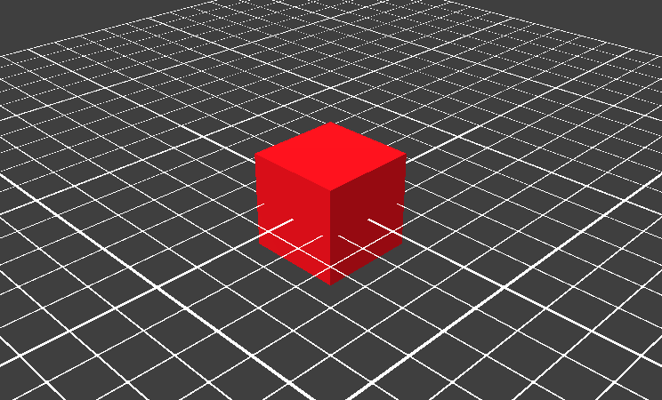

**スタック操作**
[pop](#pop) | [exch](#exch) | [dup](#dup) | [copy](#copy) | [index](#index) | [roll](#roll)

**算術・数学関数**
[add](#add) | [sub](#sub) | [mul](#mul) | [div](#div) | [idiv](#idiv) | [mod](#mod) | [abs](#abs) | [neg](#neg) | [sqrt](#sqrt) | [atan](#atan) | [cos](#cos) | [sin](#sin) | [rand](#rand) | [srand](#srand) | [rrand](#rrand)

**配列・文字列・辞書**
[length](#length) | [get](#get) | [put](#put) | [string](#string) | [cvi](#cvi) | [chr](#chr) | [getinterval](#getinterval) | [putinterval](#putinterval) | [array](#array) | [forall](#forall) | [dict](#dict) | [begin](#begin) | [end](#end) | [def](#def)

**比較・論理演算**
[eq](#eq) | [ne](#ne) | [ge](#ge) | [gt](#gt) | [le](#le) | [lt](#lt) | [and](#and) | [or](#or) | [xor](#xor) | [not](#not) | [true](#true) | [false](#false) | [null](#null)

**制御・実行**
[exec](#exec) | [if](#if) | [ifelse](#ifelse) | [repeat](#repeat) | [for](#for) | [loop](#loop) | [exit](#exit)

**Unity連携・デバッグ**
[magicactivate](#magicactivate) | [spawnobj](#spawnobj) | [transform](#transform) | [attachtoparent](#attachtoparent) | [animation](#animation) | [print](#print) | [stack](#stack)

---

## pop
 

### 説明
スタックの最上位から値を1つ取り出して破棄します。

### Code


```text
0 1 2 pop
% FinalStack is [0 1]
```
```xml
<?xml version="1.0" encoding="UTF-8"?><MagicCircleLayout startRingId="0"><Rings><Ring id="0" type="MagicRing" x="0.00" y="0.00" angle="0.0000"><Comments></Comments><Items><Item type="sigil" value="RETURN" /><Item type="chars" value="0" /><Item type="chars" value="1" /><Item type="chars" value="2" /><Item type="sigil" value="pop" /></Items></Ring></Rings><FieldItems></FieldItems></MagicCircleLayout>
```

## exch
 

### 説明
スタックの最上位にある2つの値の順番を入れ替えます。

### Code


```text
0 1 2 exch
% FinalStack is [0 2 1]
```
```xml
<?xml version="1.0" encoding="UTF-8"?><MagicCircleLayout startRingId="0"><Rings><Ring id="0" type="MagicRing" x="0.00" y="0.00" angle="0.0000"><Comments></Comments><Items><Item type="sigil" value="RETURN" /><Item type="chars" value="0" /><Item type="chars" value="1" /><Item type="chars" value="2" /><Item type="sigil" value="exch" /></Items></Ring></Rings><FieldItems></FieldItems></MagicCircleLayout>
```

## dup
 

### 説明
スタックの最上位にある値をコピーして、スタックに積み直します。

### Code


```text
0 1 2 dup
% FinalStack is [0 1 2 2]
```
```xml
<?xml version="1.0" encoding="UTF-8"?><MagicCircleLayout startRingId="0"><Rings><Ring id="0" type="MagicRing" x="0.00" y="0.00" angle="0.0000"><Comments></Comments><Items><Item type="sigil" value="RETURN" /><Item type="chars" value="0" /><Item type="chars" value="1" /><Item type="chars" value="2" /><Item type="sigil" value="dup" /></Items></Ring></Rings><FieldItems></FieldItems></MagicCircleLayout>
```

## copy
 

### 説明
スタックの上からn個の要素をコピーして、スタックに積み増します。

### Code


```text
10 20 30 2 copy
% FinalStack is [10 20 30 20 30]
```
```xml
<?xml version="1.0" encoding="UTF-8"?><MagicCircleLayout startRingId="0"><Rings><Ring id="0" type="MagicRing" x="0.00" y="0.00" angle="0.0000"><Comments></Comments><Items><Item type="sigil" value="RETURN" /><Item type="chars" value="10" /><Item type="chars" value="20" /><Item type="chars" value="30" /><Item type="chars" value="2" /><Item type="sigil" value="copy" /></Items></Ring></Rings><FieldItems></FieldItems></MagicCircleLayout>
```

## index
 

### 説明
スタックの上からn番目の要素をコピーして、スタックの最上位に積みます。

### Code


```text
10 20 30 40 2 index
% FinalStack is [10 20 30 40 20]
```
```xml
<?xml version="1.0" encoding="UTF-8"?><MagicCircleLayout startRingId="0"><Rings><Ring id="0" type="MagicRing" x="0.00" y="0.00" angle="0.0000"><Comments></Comments><Items><Item type="sigil" value="RETURN" /><Item type="chars" value="10" /><Item type="chars" value="20" /><Item type="chars" value="30" /><Item type="chars" value="40" /><Item type="chars" value="2" /><Item type="sigil" value="index" /></Items></Ring></Rings><FieldItems></FieldItems></MagicCircleLayout>
```

## roll
 

### 説明
スタックのn個の要素を、指定した回数だけ循環的に回転させます。

### Code


```text
10 20 30 40 3 1 roll
% FinalStack is [10 40 20 30]
```
```xml
<?xml version="1.0" encoding="UTF-8"?><MagicCircleLayout startRingId="0"><Rings><Ring id="0" type="MagicRing" x="0.00" y="0.00" angle="0.0000"><Comments></Comments><Items><Item type="sigil" value="RETURN" /><Item type="chars" value="10" /><Item type="chars" value="20" /><Item type="chars" value="30" /><Item type="chars" value="40" /><Item type="chars" value="3" /><Item type="chars" value="1" /><Item type="sigil" value="roll" /></Items></Ring></Rings><FieldItems></FieldItems></MagicCircleLayout>
```

## add
 

### 説明
スタックから2つ値を取り出し、足し合わせたものをスタックに積みます。

### Code


```text
1 2 add
% FinalStack is [3]
```
```xml
<?xml version="1.0" encoding="UTF-8"?><MagicCircleLayout startRingId="0"><Rings><Ring id="0" type="MagicRing" x="0.00" y="0.00" angle="0.0000"><Comments></Comments><Items><Item type="sigil" value="RETURN" /><Item type="chars" value="1" /><Item type="chars" value="2" /><Item type="sigil" value="add" /></Items></Ring></Rings><FieldItems></FieldItems></MagicCircleLayout>
```

## sub
 

### 説明
スタックから2つ値を取り出し、引き算した結果をスタックに積みます。

### Code


```text
10 3 sub
% FinalStack is [7]
```
```xml
<?xml version="1.0" encoding="UTF-8"?><MagicCircleLayout startRingId="0"><Rings><Ring id="0" type="MagicRing" x="0.00" y="0.00" angle="0.0000"><Comments></Comments><Items><Item type="sigil" value="RETURN" /><Item type="chars" value="10" /><Item type="chars" value="3" /><Item type="sigil" value="sub" /></Items></Ring></Rings><FieldItems></FieldItems></MagicCircleLayout>
```

## mul
 

### 説明
スタックから2つ値を取り出し、掛け合わせた結果をスタックに積みます。

### Code


```text
4 5 mul
% FinalStack is [20]
```
```xml
<?xml version="1.0" encoding="UTF-8"?><MagicCircleLayout startRingId="0"><Rings><Ring id="0" type="MagicRing" x="0.00" y="0.00" angle="0.0000"><Comments></Comments><Items><Item type="sigil" value="RETURN" /><Item type="chars" value="4" /><Item type="chars" value="5" /><Item type="sigil" value="mul" /></Items></Ring></Rings><FieldItems></FieldItems></MagicCircleLayout>
```

## div
 

### 説明
スタックから2つ値を取り出し、割り算した結果（実数）を積みます。

### Code


```text
10 4 div
% FinalStack is [2.5]
```
```xml
<?xml version="1.0" encoding="UTF-8"?><MagicCircleLayout startRingId="0"><Rings><Ring id="0" type="MagicRing" x="0.00" y="0.00" angle="0.0000"><Comments></Comments><Items><Item type="sigil" value="RETURN" /><Item type="chars" value="10" /><Item type="chars" value="4" /><Item type="sigil" value="div" /></Items></Ring></Rings><FieldItems></FieldItems></MagicCircleLayout>
```

## idiv
 

### 説明
スタックから2つ値を取り出し、割り算の商（整数）を積みます。

### Code


```text
10 3 idiv
% FinalStack is [3]
```
```xml
<?xml version="1.0" encoding="UTF-8"?><MagicCircleLayout startRingId="0"><Rings><Ring id="0" type="MagicRing" x="0.00" y="0.00" angle="0.0000"><Comments></Comments><Items><Item type="sigil" value="RETURN" /><Item type="chars" value="10" /><Item type="chars" value="3" /><Item type="sigil" value="idiv" /></Items></Ring></Rings><FieldItems></FieldItems></MagicCircleLayout>
```

## mod
 

### 説明
スタックから2つ値を取り出し、割り算の余りをスタックに積みます。

### Code


```text
10 3 mod
% FinalStack is [1]
```
```xml
<?xml version="1.0" encoding="UTF-8"?><MagicCircleLayout startRingId="0"><Rings><Ring id="0" type="MagicRing" x="0.00" y="0.00" angle="0.0000"><Comments></Comments><Items><Item type="sigil" value="RETURN" /><Item type="chars" value="10" /><Item type="chars" value="3" /><Item type="sigil" value="mod" /></Items></Ring></Rings><FieldItems></FieldItems></MagicCircleLayout>
```

## abs
 

### 説明
スタックの最上位にある値の絶対値を計算して積みます。

### Code


```text
-15 abs
% FinalStack is [15]
```
```xml
<?xml version="1.0" encoding="UTF-8"?><MagicCircleLayout startRingId="0"><Rings><Ring id="0" type="MagicRing" x="0.00" y="0.00" angle="0.0000"><Comments></Comments><Items><Item type="sigil" value="RETURN" /><Item type="chars" value="-15" /><Item type="sigil" value="abs" /></Items></Ring></Rings><FieldItems></FieldItems></MagicCircleLayout>
```

## neg
 

### 説明
スタックの最上位にある値の符号を反転させます。

### Code


```text
10 neg
% FinalStack is [-10]
```
```xml
<?xml version="1.0" encoding="UTF-8"?><MagicCircleLayout startRingId="0"><Rings><Ring id="0" type="MagicRing" x="0.00" y="0.00" angle="0.0000"><Comments></Comments><Items><Item type="sigil" value="RETURN" /><Item type="chars" value="10" /><Item type="sigil" value="neg" /></Items></Ring></Rings><FieldItems></FieldItems></MagicCircleLayout>
```

## sqrt
 

### 説明
スタックの最上位にある値の平方根を計算して積みます。

### Code


```text
16 sqrt
% FinalStack is [4]
```
```xml
<?xml version="1.0" encoding="UTF-8"?><MagicCircleLayout startRingId="0"><Rings><Ring id="0" type="MagicRing" x="0.00" y="0.00" angle="0.0000"><Comments></Comments><Items><Item type="sigil" value="RETURN" /><Item type="chars" value="16" /><Item type="sigil" value="sqrt" /></Items></Ring></Rings><FieldItems></FieldItems></MagicCircleLayout>
```

## atan
 

### 説明
2つの値から逆正接（アークタンジェント）を度数法で計算して積みます。

### Code


```text
1 1 atan
% FinalStack is [45]
```
```xml
<?xml version="1.0" encoding="UTF-8"?><MagicCircleLayout startRingId="0"><Rings><Ring id="0" type="MagicRing" x="0.00" y="0.00" angle="0.0000"><Comments></Comments><Items><Item type="sigil" value="RETURN" /><Item type="chars" value="1" /><Item type="chars" value="1" /><Item type="sigil" value="atan" /></Items></Ring></Rings><FieldItems></FieldItems></MagicCircleLayout>
```

## cos
 

### 説明
角度（度数法）をスタックから取り出し、余弦（コサイン）を積みます。

### Code


```text
60 cos
% FinalStack is [0.5]
```
```xml
<?xml version="1.0" encoding="UTF-8"?><MagicCircleLayout startRingId="0"><Rings><Ring id="0" type="MagicRing" x="0.00" y="0.00" angle="0.0000"><Comments></Comments><Items><Item type="sigil" value="RETURN" /><Item type="chars" value="60" /><Item type="sigil" value="cos" /></Items></Ring></Rings><FieldItems></FieldItems></MagicCircleLayout>
```

## sin
 

### 説明
角度（度数法）をスタックから取り出し、正弦（サイン）を積みます。

### Code


```text
30 sin
% FinalStack is [0.5]
```
```xml
<?xml version="1.0" encoding="UTF-8"?><MagicCircleLayout startRingId="0"><Rings><Ring id="0" type="MagicRing" x="0.00" y="0.00" angle="0.0000"><Comments></Comments><Items><Item type="sigil" value="RETURN" /><Item type="chars" value="30" /><Item type="sigil" value="sin" /></Items></Ring></Rings><FieldItems></FieldItems></MagicCircleLayout>
```

## rand
 

### 説明
0から最大値（2147483647）までの乱数を生成して積みます。

### Code


```text
rand
```
```xml
<?xml version="1.0" encoding="UTF-8"?><MagicCircleLayout startRingId="0"><Rings><Ring id="0" type="MagicRing" x="0.00" y="0.00" angle="0.0000"><Comments></Comments><Items><Item type="sigil" value="RETURN" /><Item type="sigil" value="rand" /></Items></Ring></Rings><FieldItems></FieldItems></MagicCircleLayout>
```

## srand
 

### 説明
乱数のシード値を設定します（現在の実装では未処理）。
<!--
### Code


```text
12345 srand
```
```xml
<?xml version="1.0" encoding="UTF-8"?><MagicCircleLayout startRingId="0"><Rings><Ring id="0" type="MagicRing" x="0.00" y="0.00" angle="0.0000"><Comments></Comments><Items><Item type="sigil" value="RETURN" /><Item type="chars" value="12345" /><Item type="sigil" value="srand" /></Items></Ring></Rings><FieldItems></FieldItems></MagicCircleLayout>
```
-->

## rrand
 

### 説明
現在の乱数のシード状態を取得します（現在の実装では未処理）。
<!--
### Code


```text
rrand
```
```xml
<?xml version="1.0" encoding="UTF-8"?><MagicCircleLayout startRingId="0"><Rings><Ring id="0" type="MagicRing" x="0.00" y="0.00" angle="0.0000"><Comments></Comments><Items><Item type="sigil" value="RETURN" /><Item type="sigil" value="rrand" /></Items></Ring></Rings><FieldItems></FieldItems></MagicCircleLayout>
```
-->

## length
 

### 説明
配列、辞書、または文字列の要素数（長さ）をスタックに積みます。

### Code


```text
(Hello) length
% FinalStack is [5]
```
```xml
<?xml version="1.0" encoding="UTF-8"?><MagicCircleLayout startRingId="0"><Rings><Ring id="0" type="MagicRing" x="0.00" y="0.00" angle="0.0000"><Comments></Comments><Items><Item type="sigil" value="RETURN" /><Item type="string" value="Hello" /><Item type="sigil" value="length" /></Items></Ring></Rings><FieldItems></FieldItems></MagicCircleLayout>
```

## get
 

### 説明
配列や辞書から、指定したインデックスやキーに対応する値を取り出します。

### Code


```text
[10 20 30] 1 get
% FinalStack is [20]
```
```xml
<?xml version="1.0" encoding="UTF-8"?><MagicCircleLayout startRingId="0"><Rings><Ring id="0" type="MagicRing" x="0.00" y="0.00" angle="0.0000"><Comments></Comments><Items><Item type="sigil" value="RETURN" /><Item type="joint" value="1" isExecute="false" /><Item type="chars" value="1" /><Item type="sigil" value="get" /></Items></Ring><Ring id="1" type="ArrayRing" x="-177.48" y="2.79" angle="1.5551" visualEffect="-"><Comments></Comments><Items><Item type="sigil" value="COMPLETE" /><Item type="chars" value="10" /><Item type="chars" value="20" /><Item type="chars" value="30" /></Items></Ring> </Rings> <FieldItems> </FieldItems></MagicCircleLayout>
```

## put
 

### 説明
配列や辞書、文字列の指定した位置に、新しい値を書き込みます。

### Code


```text
[10 20 30] dup 1 99 put
% FinalStack is [[10 99 30]]
```
```xml
<?xml version="1.0" encoding="UTF-8"?><MagicCircleLayout startRingId="0"><Rings><Ring id="0" type="MagicRing" x="0.00" y="0.00" angle="0.0000"><Comments></Comments><Items><Item type="sigil" value="RETURN" /><Item type="joint" value="1" isExecute="false" /><Item type="sigil" value="dup" /><Item type="chars" value="1" /><Item type="chars" value="99" /><Item type="sigil" value="put" /></Items></Ring><Ring id="1" type="ArrayRing" x="-152.40" y="-90.99" angle="2.1091" visualEffect="-"><Comments></Comments><Items><Item type="sigil" value="COMPLETE" /><Item type="chars" value="10" /><Item type="chars" value="20" /><Item type="chars" value="30" /></Items></Ring></Rings><FieldItems></FieldItems></MagicCircleLayout>
```

## string
 

### 説明
指定した長さの空の文字列オブジェクトを作成して積みます。

### Code


```text
10 string
% FinalStack is ["          "]
```
```xml
<?xml version="1.0" encoding="UTF-8"?><MagicCircleLayout startRingId="0"><Rings><Ring id="0" type="MagicRing" x="0.00" y="0.00" angle="0.0000"><Comments></Comments><Items><Item type="sigil" value="RETURN" /><Item type="chars" value="10" /><Item type="sigil" value="string" /></Items></Ring></Rings><FieldItems></FieldItems></MagicCircleLayout>
```

## cvi
 

### 説明
文字列の最初の文字を、その文字コード（整数）に変換して積みます。

### Code


```text
(A) cvi
% FinalStack is [65]
```
```xml
<?xml version="1.0" encoding="UTF-8"?><MagicCircleLayout startRingId="0"><Rings><Ring id="0" type="MagicRing" x="0.00" y="0.00" angle="0.0000"><Comments></Comments><Items><Item type="sigil" value="RETURN" /><Item type="string" value="A" /><Item type="sigil" value="cvi" /></Items></Ring></Rings><FieldItems></FieldItems></MagicCircleLayout>
```

## chr
 

### 説明
整数（文字コード）を、対応する1文字の文字列に変換して積みます。

### Code


```text
65 chr
% FinalStack is ["A"]
```
```xml
<?xml version="1.0" encoding="UTF-8"?><MagicCircleLayout startRingId="0"><Rings><Ring id="0" type="MagicRing" x="0.00" y="0.00" angle="0.0000"><Comments></Comments><Items><Item type="sigil" value="RETURN" /><Item type="chars" value="65" /><Item type="sigil" value="chr" /></Items></Ring></Rings><FieldItems></FieldItems></MagicCircleLayout>
```

## getinterval
 

### 説明
配列や文字列から、指定範囲の部分配列・文字列を抽出します。

### Code


```text
(abcdef) 1 3 getinterval
% FinalStack is ["bcd"]
```
```xml
<?xml version="1.0" encoding="UTF-8"?><MagicCircleLayout startRingId="0"><Rings><Ring id="0" type="MagicRing" x="0.00" y="0.00" angle="0.0000"><Comments></Comments><Items><Item type="sigil" value="RETURN" /><Item type="string" value="abcdef" /><Item type="chars" value="1" /><Item type="chars" value="3" /><Item type="sigil" value="getinterval" /></Items></Ring></Rings><FieldItems></FieldItems></MagicCircleLayout>
```

## putinterval
 

### 説明
配列や文字列の指定位置に、別の配列や文字列の内容を上書きします。

### Code


```text
(abcdef) 1 (XYZ) putinterval print
% FinalStack is ["aXYZef"]
```
```xml
<?xml version="1.0" encoding="UTF-8"?><MagicCircleLayout startRingId="0"><Rings><Ring id="0" type="MagicRing" x="0.00" y="0.00" angle="0.0000"><Comments></Comments><Items><Item type="sigil" value="RETURN" /><Item type="string" value="abcdef" /><Item type="chars" value="1" /><Item type="string" value="XYZ" /><Item type="sigil" value="putinterval" /></Items></Ring></Rings><FieldItems></FieldItems></MagicCircleLayout>
```

## array
 

### 説明
指定した要素数を持つ、空の配列オブジェクトを作成して積みます。

### Code


```text
5 array
% FinalStack is [[null null null null null]]
```
```xml
<?xml version="1.0" encoding="UTF-8"?><MagicCircleLayout startRingId="0"><Rings><Ring id="0" type="MagicRing" x="0.00" y="0.00" angle="0.0000"><Comments></Comments><Items><Item type="sigil" value="RETURN" /><Item type="chars" value="5" /><Item type="sigil" value="array" /></Items></Ring></Rings><FieldItems></FieldItems></MagicCircleLayout>
```

## forall
 

### 説明
配列や辞書の各要素に対して、指定した手続きを繰り返し実行します。

### Code


```text
[(apple) (banana) (orange)] { print } forall
% apple
% banana
% orange
```
```xml
<?xml version="1.0" encoding="UTF-8"?><MagicCircleLayout startRingId="0"><Rings><Ring id="0" type="MagicRing" x="0.00" y="0.00" angle="0.0000"><Comments></Comments><Items><Item type="sigil" value="RETURN" /><Item type="joint" value="2" isExecute="false" /><Item type="joint" value="1" isExecute="false" /><Item type="sigil" value="forall" /></Items></Ring><Ring id="1" type="MagicRing" x="-60.26" y="185.46" angle="0.3142"><Comments></Comments><Items><Item type="sigil" value="RETURN" /><Item type="sigil" value="print" /></Items></Ring><Ring id="2" type="ArrayRing" x="-177.50" y="-0.00" angle="1.5708" visualEffect="-"><Comments></Comments><Items><Item type="sigil" value="COMPLETE" /><Item type="string" value="apple" /><Item type="string" value="banana" /><Item type="string" value="orange" /></Items></Ring></Rings><FieldItems></FieldItems></MagicCircleLayout>
```

## dict
 

### 説明
新しい空の辞書（連想配列）を作成してスタックに積みます。

### Code


```text
dict
% FinalStack is [{}]
```
```xml
<?xml version="1.0" encoding="UTF-8"?><MagicCircleLayout startRingId="0"><Rings><Ring id="0" type="MagicRing" x="0.00" y="0.00" angle="0.0000"><Comments></Comments><Items><Item type="sigil" value="RETURN" /><Item type="sigil" value="dict" /></Ring></Rings><FieldItems></FieldItems></MagicCircleLayout>
```

## begin
 

### 説明
辞書を辞書スタックに積み、以降の変数定義や検索の対象にします。

## end
 

### 説明
現在アクティブな辞書を辞書スタックから取り除きます。

### Code


```text
\a 23 def dict begin \a 42 def a print end a print
% 42
% 23
```
```xml
<?xml version="1.0" encoding="UTF-8"?><MagicCircleLayout startRingId="0"><Rings><Ring id="0" type="MagicRing" x="0.00" y="0.00" angle="0.0000"><Comments></Comments><Items><Item type="sigil" value="RETURN" /><Item type="name" value="a" /><Item type="chars" value="23" /><Item type="sigil" value="def" /><Item type="sigil" value="dict" /><Item type="sigil" value="begin" /><Item type="name" value="a" /><Item type="chars" value="42" /><Item type="sigil" value="def" /><Item type="chars" value="a" /><Item type="sigil" value="print" /><Item type="sigil" value="end" /><Item type="chars" value="a" /><Item type="sigil" value="print" /></Items></Ring></Rings><FieldItems></FieldItems></MagicCircleLayout>

```

## def
 

### 説明
現在の辞書に、名前と値を対応付けて変数を定義します。

### Code


```text
/x 100 def
```
```xml
<?xml version="1.0" encoding="UTF-8"?><MagicCircleLayout startRingId="0"><Rings><Ring id="0" type="MagicRing" x="0.00" y="0.00" angle="0.0000"><Comments></Comments><Items><Item type="sigil" value="RETURN" /><Item type="name" value="x" /><Item type="chars" value="100" /><Item type="sigil" value="def" /></Items></Ring></Rings><FieldItems></FieldItems></MagicCircleLayout>
```

## eq
 

### 説明
スタックの2つの値が等しければtrue、そうでなければfalseを積みます。

### Code


```text
5 5 eq
% FinalStack is [true]
```
```xml
<?xml version="1.0" encoding="UTF-8"?><MagicCircleLayout startRingId="0"><Rings><Ring id="0" type="MagicRing" x="0.00" y="0.00" angle="0.0000"><Comments></Comments><Items><Item type="sigil" value="RETURN" /><Item type="chars" value="5" /><Item type="chars" value="5" /><Item type="sigil" value="eq" /></Items></Ring></Rings><FieldItems></FieldItems></MagicCircleLayout>
```

## ne
 

### 説明
スタックの2つの値が等しくなければtrue、等しければfalseを積みます。

### Code


```text
5 10 ne
% FinalStack is [true]
```
```xml
<?xml version="1.0" encoding="UTF-8"?><MagicCircleLayout startRingId="0"><Rings><Ring id="0" type="MagicRing" x="0.00" y="0.00" angle="0.0000"><Comments></Comments><Items><Item type="sigil" value="RETURN" /><Item type="chars" value="5" /><Item type="chars" value="10" /><Item type="sigil" value="ne" /></Items></Ring></Rings><FieldItems></FieldItems></MagicCircleLayout>
```

## ge
 

### 説明
1つ目の値が2つ目の値以上であればtrueをスタックに積みます。

### Code


```text
10 5 ge
% FinalStack is [true]
```
```xml
<?xml version="1.0" encoding="UTF-8"?><MagicCircleLayout startRingId="0"><Rings><Ring id="0" type="MagicRing" x="0.00" y="0.00" angle="0.0000"><Comments></Comments><Items><Item type="sigil" value="RETURN" /><Item type="chars" value="10" /><Item type="chars" value="5" /><Item type="sigil" value="ge" /></Items></Ring></Rings><FieldItems></FieldItems></MagicCircleLayout>
```

## gt
 

### 説明
1つ目の値が2つ目の値より大きければtrueをスタックに積みます。

### Code


```text
10 5 gt
% FinalStack is [true]
```
```xml
<?xml version="1.0" encoding="UTF-8"?><MagicCircleLayout startRingId="0"><Rings><Ring id="0" type="MagicRing" x="0.00" y="0.00" angle="0.0000"><Comments></Comments><Items><Item type="sigil" value="RETURN" /><Item type="chars" value="10" /><Item type="chars" value="5" /><Item type="sigil" value="gt" /></Items></Ring></Rings><FieldItems></FieldItems></MagicCircleLayout>
```

## le
 

### 説明
1つ目の値が2つ目の値以下であればtrueをスタックに積みます。

### Code


```text
5 10 le
% FinalStack is [true]
```
```xml
<?xml version="1.0" encoding="UTF-8"?><MagicCircleLayout startRingId="0"><Rings><Ring id="0" type="MagicRing" x="0.00" y="0.00" angle="0.0000"><Comments></Comments><Items><Item type="sigil" value="RETURN" /><Item type="chars" value="5" /><Item type="chars" value="10" /><Item type="sigil" value="le" /></Items></Ring></Rings><FieldItems></FieldItems></MagicCircleLayout>
```

## lt
 

### 説明
1つ目の値が2つ目の値より小さければtrueをスタックに積みます。

### Code


```text
5 10 lt
% FinalStack is [true]
```
```xml
<?xml version="1.0" encoding="UTF-8"?><MagicCircleLayout startRingId="0"><Rings><Ring id="0" type="MagicRing" x="0.00" y="0.00" angle="0.0000"><Comments></Comments><Items><Item type="sigil" value="RETURN" /><Item type="chars" value="5" /><Item type="chars" value="10" /><Item type="sigil" value="lt" /></Items></Ring></Rings><FieldItems></FieldItems></MagicCircleLayout>
```

## and
 

### 説明
2つの論理値の論理積（AND）を計算してスタックに積みます。

### Code


```text
true false and
% FinalStack is [false]
```
```xml
<?xml version="1.0" encoding="UTF-8"?><MagicCircleLayout startRingId="0"><Rings><Ring id="0" type="MagicRing" x="0.00" y="0.00" angle="0.0000"><Comments></Comments><Items><Item type="sigil" value="RETURN" /><Item type="sigil" value="true" /><Item type="sigil" value="false" /><Item type="sigil" value="and" /></Items></Ring></Rings><FieldItems></FieldItems></MagicCircleLayout>
```

## or
 

### 説明
2つの論理値の論理和（OR）を計算してスタックに積みます。

### Code


```text
true false or
% FinalStack is [true]
```
```xml
<?xml version="1.0" encoding="UTF-8"?><MagicCircleLayout startRingId="0"><Rings><Ring id="0" type="MagicRing" x="0.00" y="0.00" angle="0.0000"><Comments></Comments><Items><Item type="sigil" value="RETURN" /><Item type="sigil" value="true" /><Item type="sigil" value="false" /><Item type="sigil" value="or" /></Items></Ring></Rings><FieldItems></FieldItems></MagicCircleLayout>
```

## xor
 

### 説明
2つの論理値の排他的論理和（XOR）を計算して積みます。

### Code


```text
true false xor
 % FinalStack is [true]
```
```xml
<?xml version="1.0" encoding="UTF-8"?><MagicCircleLayout startRingId="0"><Rings><Ring id="0" type="MagicRing" x="0.00" y="0.00" angle="0.0000"><Comments></Comments><Items><Item type="sigil" value="RETURN" /><Item type="sigil" value="true" /><Item type="sigil" value="false" /><Item type="sigil" value="xor" /></Items></Ring></Rings><FieldItems></FieldItems></MagicCircleLayout>
```

## not
 

### 説明
スタック最上位の論理値を反転（真偽を逆に）させます。

### Code


```text
true not
% FinalStack is [false]
```
```xml
<?xml version="1.0" encoding="UTF-8"?><MagicCircleLayout startRingId="0"><Rings><Ring id="0" type="MagicRing" x="0.00" y="0.00" angle="0.0000"><Comments></Comments><Items><Item type="sigil" value="RETURN" /><Item type="sigil" value="true" /><Item type="sigil" value="not" /></Items></Ring></Rings><FieldItems></FieldItems></MagicCircleLayout>
```

## true
 

### 説明
論理値の真（true）をスタックに積みます。

### Code


```text
true
% FinalStack is [true]
```
```xml
<?xml version="1.0" encoding="UTF-8"?><MagicCircleLayout startRingId="0"><Rings><Ring id="0" type="MagicRing" x="0.00" y="0.00" angle="0.0000"><Comments></Comments><Items><Item type="sigil" value="RETURN" /><Item type="sigil" value="true" /></Items></Ring></Rings><FieldItems></FieldItems></MagicCircleLayout>
```

## false
 

### 説明
論理値の偽（false）をスタックに積みます。

### Code


```text
false
% FinalStack is false
```
```xml
<?xml version="1.0" encoding="UTF-8"?><MagicCircleLayout startRingId="0"><Rings><Ring id="0" type="MagicRing" x="0.00" y="0.00" angle="0.0000"><Comments></Comments><Items><Item type="sigil" value="RETURN" /><Item type="sigil" value="false" /></Items></Ring></Rings><FieldItems></FieldItems></MagicCircleLayout>
```

## null
 

### 説明
null値をスタックに積みます。

### Code


```text
null
% FinalStack is [null]
```
```xml
<?xml version="1.0" encoding="UTF-8"?><MagicCircleLayout startRingId="0"><Rings><Ring id="0" type="MagicRing" x="0.00" y="0.00" angle="0.0000"><Comments></Comments><Items><Item type="sigil" value="RETURN" /><Item type="sigil" value="null" /></Items></Ring></Rings><FieldItems></FieldItems></MagicCircleLayout>
```

## exec
 

### 説明
スタックにある手続き（プログラムの塊）を実行します。

### Code


```text
{ (Hello) print } exec
% Hello
```
```xml
<?xml version="1.0" encoding="UTF-8"?><MagicCircleLayout startRingId="0"><Rings><Ring id="0" type="MagicRing" x="0.00" y="0.00" angle="0.0000"><Comments></Comments><Items><Item type="sigil" value="RETURN" /><Item type="joint" value="1" isExecute="false" /><Item type="sigil" value="exec" /></Items></Ring><Ring id="1" type="MagicRing" x="-178.14" y="79.31" angle="1.1519"><Comments></Comments><Items><Item type="sigil" value="RETURN" /><Item type="string" value="Hello" /><Item type="sigil" value="print" /></Items></Ring></Rings><FieldItems></FieldItems></MagicCircleLayout>

```

## if
 

### 説明
条件が真の場合に、指定した手続きを実行します。

### Code


```text
true { 100 print } if
% 100
```
```xml
<?xml version="1.0" encoding="UTF-8"?><MagicCircleLayout startRingId="0"><Rings><Ring id="0" type="MagicRing" x="0.00" y="0.00" angle="0.0000"><Comments></Comments><Items><Item type="sigil" value="RETURN" /><Item type="sigil" value="true" /><Item type="joint" value="1" isExecute="false" /><Item type="sigil" value="if" /></Items></Ring><Ring id="1" type="MagicRing" x="-0.00" y="195.00" angle="0.0000"><Comments></Comments><Items><Item type="sigil" value="RETURN" /><Item type="chars" value="100" /><Item type="sigil" value="print" /></Items></Ring></Rings><FieldItems></FieldItems></MagicCircleLayout>

```

## ifelse
 

### 説明
条件に応じて、実行する2つの手続きを切り替えます。

### Code


```text
true { 1 print } { 2 print } ifelse
% 1
```
```xml
<?xml version="1.0" encoding="UTF-8"?><MagicCircleLayout startRingId="0"><Rings><Ring id="0" type="MagicRing" x="0.00" y="0.00" angle="0.0000"><Comments></Comments><Items><Item type="sigil" value="RETURN" /><Item type="sigil" value="true" /><Item type="joint" value="1" isExecute="false" /><Item type="joint" value="2" isExecute="false" /><Item type="sigil" value="ifelse" /></Items></Ring><Ring id="1" type="MagicRing" x="-83.03" y="176.44" angle="0.4398"><Comments></Comments><Items><Item type="sigil" value="RETURN" /><Item type="chars" value="1" /><Item type="sigil" value="print" /></Items></Ring><Ring id="2" type="MagicRing" x="83.03" y="176.44" angle="-0.4398"><Comments></Comments><Items><Item type="sigil" value="RETURN" /><Item type="chars" value="2" /><Item type="sigil" value="print" /></Items></Ring></Rings><FieldItems></FieldItems></MagicCircleLayout>
```

## repeat
 

### 説明
指定した回数だけ、手続きを繰り返し実行します。

### Code


```text
3 { 1 print } repeat
% 1
% 1
% 1
```
```xml
<?xml version="1.0" encoding="UTF-8"?><MagicCircleLayout startRingId="0"><Rings><Ring id="0" type="MagicRing" x="0.00" y="0.00" angle="0.0000"><Comments></Comments><Items><Item type="sigil" value="RETURN" /><Item type="chars" value="3" /><Item type="joint" value="1" isExecute="false" /><Item type="sigil" value="repeat" /></Items></Ring><Ring id="1" type="MagicRing" x="-66.05" y="183.47" angle="0.3456"><Comments></Comments><Items><Item type="sigil" value="RETURN" /><Item type="chars" value="1" /><Item type="sigil" value="print" /></Items></Ring></Rings><FieldItems></FieldItems></MagicCircleLayout>
```

## for
 

### 説明
開始、増分、終了値を指定して、数値を変化させながら手続きを繰り返します。

### Code


```text
0 1 3 { print } for
% 0
% 1
% 2
% 3
```
```xml
<?xml version="1.0" encoding="UTF-8"?><MagicCircleLayout startRingId="0"><Rings><Ring id="0" type="MagicRing" x="0.00" y="0.00" angle="0.0000"><Comments></Comments><Items><Item type="sigil" value="RETURN" /><Item type="chars" value="0" /><Item type="chars" value="1" /><Item type="chars" value="3" /><Item type="joint" value="1" isExecute="false" /><Item type="sigil" value="for" /></Items></Ring><Ring id="1" type="MagicRing" x="86.70" y="174.66" angle="-0.4608"><Comments></Comments><Items><Item type="sigil" value="RETURN" /><Item type="sigil" value="print" /></Items></Ring></Rings><FieldItems></FieldItems></MagicCircleLayout>
```

## loop
 

### 説明
exitが呼ばれるまで、手続きを無限に繰り返し実行します。

## exit
 

### 説明
実行中のloop（繰り返し）から即座に脱出します。

### Code


```text
\n 0 def { n print \n n 1 add def n 3 ge { exit } if } loop
% 0
% 1
% 2
```
```xml
<?xml version="1.0" encoding="UTF-8"?><MagicCircleLayout startRingId="0"><Rings><Ring id="0" type="MagicRing" x="0.00" y="0.00" angle="0.0000"><Comments></Comments><Items><Item type="sigil" value="RETURN" /><Item type="name" value="n" /><Item type="chars" value="0" /><Item type="sigil" value="def" /><Item type="joint" value="1" isExecute="false" /><Item type="sigil" value="loop" /></Items></Ring><Ring id="1" type="MagicRing" x="188.10" y="130.73" angle="-0.9634"><Comments></Comments><Items><Item type="sigil" value="RETURN" /><Item type="chars" value="n" /><Item type="sigil" value="print" /><Item type="name" value="n" /><Item type="chars" value="n" /><Item type="chars" value="1" /><Item type="sigil" value="add" /><Item type="sigil" value="def" /><Item type="chars" value="n" /><Item type="chars" value="3" /><Item type="sigil" value="ge" /><Item type="joint" value="2" isExecute="false" /><Item type="sigil" value="if" /></Items></Ring><Ring id="2" type="MagicRing" x="228.37" y="-96.22" angle="3.3172"><Comments></Comments><Items><Item type="sigil" value="RETURN" /><Item type="sigil" value="exit" /></Items></Ring></Rings><FieldItems></FieldItems></MagicCircleLayout>
```

## magicactivate
 

### 説明
指定したデータを魔法としてUnity側に送信し実行します。

### Code


```text
\fire < \main < \startLifetime [ 0.5 2 ] \startSpeed 0.5 \startSize [ 0.2 0.4 ] \startRotation [ 0 360 ] > \emission < \rateOverTime 50 > \shape < \angle 5 \radius 0.0001 > \colorOverLifetime < \gradient [ [ 0.000 1.000 0.600 0.000 0.000 ] [ 0.500 1.000 0.099 0.000 1.000 ] [ 0.600 1.000 0.000 0.000 0.802 ] [ 1.000 1.000 0.000 0.000 0.000 ] ] > \rotationOverLifetime < z [ -45 45 ] > \renderer < \materialName (Fire_1) > > magicactivate fire < \rotation [ -90 0 0 ] \scale 2 > transform 
```
```xml
<?xml version="1.0" encoding="UTF-8"?><MagicCircleLayout startRingId="0"><Rings><Ring id="0" type="MagicRing" x="0.00" y="0.00" angle="0.0000"><Comments></Comments><Items><Item type="sigil" value="RETURN" /><Item type="name" value="fire" /><Item type="joint" value="1" isExecute="false" /><Item type="sigil" value="magicactivate" /><Item type="chars" value="fire" /><Item type="joint" value="12" isExecute="false" /><Item type="sigil" value="transform" /></Items></Ring><Ring id="1" type="DictRing" x="-593.26" y="225.61" angle="1.2074"><Comments></Comments><Items><Item type="sigil" value="COMPLETE" /><Item type="name" value="main" /><Item type="joint" value="2" isExecute="false" /><Item type="name" value="emission" /><Item type="joint" value="3" isExecute="false" /><Item type="name" value="shape" /><Item type="joint" value="4" isExecute="false" /><Item type="name" value="colorOverLifetime" /><Item type="joint" value="5" isExecute="false" /><Item type="name" value="rotationOverLifetime" /><Item type="joint" value="6" isExecute="false" /><Item type="name" value="renderer" /><Item type="joint" value="7" isExecute="false" /></Items></Ring><Ring id="2" type="DictRing" x="-349.59" y="-200.95" angle="3.6606"><Comments></Comments><Items><Item type="sigil" value="COMPLETE" /><Item type="name" value="startLifetime" /><Item type="joint" value="8" isExecute="false" /><Item type="name" value="startSpeed" /><Item type="chars" value="0.5" /><Item type="name" value="startSize" /><Item type="joint" value="9" isExecute="false" /><Item type="name" value="startRotation" /><Item type="joint" value="10" isExecute="false" /></Items></Ring><Ring id="3" type="DictRing" x="-677.90" y="-57.63" angle="2.8512"><Comments></Comments><Items><Item type="sigil" value="COMPLETE" /><Item type="name" value="rateOverTime" /><Item type="chars" value="50" /></Items></Ring><Ring id="4" type="DictRing" x="-822.40" y="38.86" angle="2.2546"><Comments></Comments><Items><Item type="sigil" value="COMPLETE" /><Item type="name" value="angle" /><Item type="chars" value="5" /><Item type="name" value="radius" /><Item type="chars" value="0.0001" /></Items></Ring><Ring id="5" type="DictRing" x="-861.18" y="482.25" angle="0.8069"><Comments></Comments><Items><Item type="sigil" value="COMPLETE" /><Item type="name" value="gradient" /><Item type="joint" value="14" isExecute="false" /></Items></Ring><Ring id="6" type="DictRing" x="-368.82" y="421.34" angle="-0.8536"><Comments></Comments><Items><Item type="sigil" value="COMPLETE" /><Item type="name" value="z" /><Item type="joint" value="11" isExecute="false" /></Items></Ring><Ring id="7" type="DictRing" x="-269.96" y="195.71" angle="4.6202"><Comments></Comments><Items><Item type="sigil" value="COMPLETE" /><Item type="name" value="materialName" /><Item type="string" value="Fire_1" /></Items></Ring><Ring id="8" type="ArrayRing" x="-127.39" y="-112.65" angle="-1.1925" visualEffect="-"><Comments></Comments><Items><Item type="sigil" value="COMPLETE" /><Item type="chars" value="0.5" /><Item type="chars" value="2" /></Items></Ring><Ring id="9" type="ArrayRing" x="-501.02" y="-385.99" angle="2.4558" visualEffect="-"><Comments></Comments><Items><Item type="sigil" value="COMPLETE" /><Item type="chars" value="0.2" /><Item type="chars" value="0.4" /></Items></Ring><Ring id="10" type="ArrayRing" x="-534.63" y="-49.53" angle="0.8850" visualEffect="-"><Comments></Comments><Items><Item type="sigil" value="COMPLETE" /><Item type="chars" value="0" /><Item type="chars" value="360" /></Items></Ring><Ring id="11" type="ArrayRing" x="-211.10" y="339.90" angle="4.2358" visualEffect="-"><Comments></Comments><Items><Item type="sigil" value="COMPLETE" /><Item type="chars" value="-45" /><Item type="chars" value="45" /></Items></Ring><Ring id="12" type="DictRing" x="187.67" y="47.15" angle="-1.3246"><Comments></Comments><Items><Item type="sigil" value="COMPLETE" /><Item type="name" value="rotation" /><Item type="joint" value="13" isExecute="false" /><Item type="name" value="scale" /><Item type="chars" value="2" /></Items></Ring><Ring id="13" type="ArrayRing" x="359.93" y="89.98" angle="-1.3271" visualEffect="-"><Comments></Comments><Items><Item type="sigil" value="COMPLETE" /><Item type="chars" value="-90" /><Item type="chars" value="0" /><Item type="chars" value="0" /></Items></Ring><Ring id="14" type="ArrayRing" x="-734.76" y="661.94" angle="-0.6131" visualEffect="gradient"><Comments></Comments><Items><Item type="sigil" value="COMPLETE" /><Item type="joint" value="15" isExecute="false" /><Item type="joint" value="16" isExecute="false" /><Item type="joint" value="17" isExecute="false" /><Item type="joint" value="18" isExecute="false" /></Items></Ring><Ring id="15" type="ArrayRing" x="-890.08" y="753.90" angle="1.0362" visualEffect="gradient-sub"><Comments></Comments><Items><Item type="sigil" value="COMPLETE" /><Item type="chars" value="0.000" /><Item type="chars" value="1.000" /><Item type="chars" value="0.600" /><Item type="chars" value="0.000" /><Item type="chars" value="0.000" /></Items></Ring><Ring id="16" type="ArrayRing" x="-723.33" y="842.08" angle="-0.0633" visualEffect="gradient-sub"><Comments></Comments><Items><Item type="sigil" value="COMPLETE" /><Item type="chars" value="0.500" /><Item type="chars" value="1.000" /><Item type="chars" value="0.099" /><Item type="chars" value="0.000" /><Item type="chars" value="1.000" /></Items></Ring><Ring id="17" type="ArrayRing" x="-569.07" y="733.54" angle="-1.1629" visualEffect="-"><Comments></Comments><Items><Item type="sigil" value="COMPLETE" /><Item type="chars" value="0.600" /><Item type="chars" value="1.000" /><Item type="chars" value="0.000" /><Item type="chars" value="0.000" /><Item type="chars" value="0.802" /></Items></Ring><Ring id="18" type="ArrayRing" x="-595.74" y="546.82" angle="4.0207" visualEffect="-"><Comments></Comments><Items><Item type="sigil" value="COMPLETE" /><Item type="chars" value="1.000" /><Item type="chars" value="1.000" /><Item type="chars" value="0.000" /><Item type="chars" value="0.000" /><Item type="chars" value="0.000" /></Items></Ring></Rings><FieldItems></FieldItems></MagicCircleLayout>
```

## spawnobj
 

### 説明
指定したパラメータでUnity上に新しいオブジェクトを生成します。

### Code


```text
< \shape (cube) \color [ 1.000 0.000 0.000 1.000 ] > spawnobj 
```
```xml
<?xml version="1.0" encoding="UTF-8"?><MagicCircleLayout startRingId="0"><Rings><Ring id="0" type="MagicRing" x="0.00" y="0.00" angle="0.0000"><Comments></Comments><Items><Item type="sigil" value="RETURN" /><Item type="joint" value="1" isExecute="false" /><Item type="sigil" value="spawnobj" /></Items></Ring><Ring id="1" type="DictRing" x="-196.76" y="87.61" angle="1.1519"><Comments></Comments><Items><Item type="sigil" value="COMPLETE" /><Item type="name" value="shape" /><Item type="string" value="cube" /><Item type="name" value="color" /><Item type="joint" value="2" isExecute="false" /></Items></Ring><Ring id="2" type="ArrayRing" x="-31.46" y="176.51" angle="-1.0774" visualEffect="color"><Comments></Comments><Items><Item type="sigil" value="COMPLETE" /><Item type="chars" value="1.000" /><Item type="chars" value="0.000" /><Item type="chars" value="0.000" /><Item type="chars" value="1.000" /></Items></Ring></Rings><FieldItems></FieldItems></MagicCircleLayout>
```

## transform
 

### 説明
Unityオブジェクトの位置、回転、スケールを変更します。

### Code


```text
 \obj < \shape (cube) > spawnobj obj < \position [ 1 2 3 ] > transform 
 ```
```xml
<?xml version="1.0" encoding="UTF-8"?><MagicCircleLayout startRingId="0"><Rings><Ring id="0" type="MagicRing" x="0.00" y="0.00" angle="0.0000"><Comments></Comments><Items><Item type="sigil" value="RETURN" /><Item type="name" value="obj" /><Item type="joint" value="1" isExecute="false" /><Item type="sigil" value="spawnobj" /><Item type="chars" value="obj" /><Item type="joint" value="2" isExecute="false" /><Item type="sigil" value="transform" /></Items></Ring><Ring id="1" type="DictRing" x="-196.07" y="89.15" angle="1.1440"><Comments></Comments><Items><Item type="sigil" value="COMPLETE" /><Item type="name" value="shape" /><Item type="string" value="cube" /></Items></Ring><Ring id="2" type="DictRing" x="204.07" y="64.40" angle="-1.2651"><Comments></Comments><Items><Item type="sigil" value="COMPLETE" /><Item type="name" value="position" /><Item type="joint" value="3" isExecute="false" /><Item type="name" value="rotation" /><Item type="joint" value="4" isExecute="false" /><Item type="name" value="scale" /><Item type="chars" value="2" /></Items></Ring><Ring id="3" type="ArrayRing" x="270.21" y="241.56" angle="-0.3573" visualEffect="-"><Comments></Comments><Items><Item type="sigil" value="COMPLETE" /><Item type="chars" value="1" /><Item type="chars" value="2" /><Item type="chars" value="3" /></Items></Ring><Ring id="4" type="ArrayRing" x="340.45" y="-66.60" angle="3.9471" visualEffect="-"><Comments></Comments><Items><Item type="sigil" value="COMPLETE" /><Item type="chars" value="45" /><Item type="chars" value="-90" /><Item type="chars" value="180" /></Items></Ring></Rings><FieldItems></FieldItems></MagicCircleLayout>
```

## attachtoparent
 

### 説明
Unityオブジェクトを別のオブジェクトの子要素にします。

### Code


```text
\parent < \shape (empty) > spawnobj \child < \shape (cube) > spawnobj child parent attachtoparent
```
```xml
<?xml version="1.0" encoding="UTF-8"?><MagicCircleLayout startRingId="0"><Rings><Ring id="0" type="MagicRing" x="0.00" y="0.00" angle="0.0000"><Comments></Comments><Items><Item type="sigil" value="RETURN" /><Item type="name" value="parent" /><Item type="joint" value="1" isExecute="false" /><Item type="sigil" value="spawnobj" /><Item type="name" value="child" /><Item type="joint" value="2" isExecute="false" /><Item type="sigil" value="spawnobj" /><Item type="chars" value="child" /><Item type="chars" value="parent" /><Item type="sigil" value="attachtoparent" /></Items></Ring><Ring id="1" type="DictRing" x="-225.82" y="-59.79" angle="1.8296"><Comments></Comments><Items><Item type="sigil" value="COMPLETE" /><Item type="name" value="shape" /><Item type="string" value="empty" /></Items></Ring><Ring id="2" type="DictRing" x="-41.20" y="229.94" angle="0.1773"><Comments></Comments><Items><Item type="sigil" value="COMPLETE" /><Item type="name" value="shape" /><Item type="string" value="cube" /></Items></Ring></Rings><FieldItems></FieldItems></MagicCircleLayout>
```

## animation
 

### 説明
Unityオブジェクトに対して、指定したアニメーションを再生します。

### Code


```text
\obj < \shape (cube) > spawnobj $obj < \position < \from [ 3 0 0 ] \to [ -3 0 0 ] \duration 3000 \loop true \reverse true \easeIn true \easeOut true > \rotate < \from [ 0 0 0 ] \to [ 360 0 0 ] \loop true > \scale < \from [ 0.1 0.1 0.1 ] \to [ 5 5 5 ] \duration 1500 \loop true \reverse true \easeIn true \easeOut true > > animation 
```
```xml
<?xml version="1.0" encoding="UTF-8"?><MagicCircleLayout startRingId="0"><Rings><Ring id="0" type="MagicRing" x="0.00" y="0.00" angle="0.0000"><Comments></Comments><Items><Item type="sigil" value="RETURN" /><Item type="name" value="obj" /><Item type="joint" value="1" isExecute="false" /><Item type="sigil" value="spawnobj" /><Item type="chars" value="obj" /><Item type="joint" value="2" isExecute="false" /><Item type="sigil" value="animation" /></Items></Ring><Ring id="1" type="DictRing" x="-179.24" y="81.50" angle="1.1440"><Comments></Comments><Items><Item type="sigil" value="COMPLETE" /><Item type="name" value="shape" /><Item type="string" value="cube" /></Items></Ring><Ring id="2" type="DictRing" x="209.95" y="66.26" angle="-1.2651"><Comments></Comments><Items><Item type="sigil" value="COMPLETE" /><Item type="name" value="position" /><Item type="joint" value="3" isExecute="false" /><Item type="name" value="rotate" /><Item type="joint" value="6" isExecute="false" /><Item type="name" value="scale" /><Item type="joint" value="9" isExecute="false" /></Items></Ring><Ring id="3" type="DictRing" x="358.10" y="359.61" angle="-0.4677"><Comments></Comments><Items><Item type="sigil" value="COMPLETE" /><Item type="name" value="from" /><Item type="joint" value="4" isExecute="false" /><Item type="name" value="to" /><Item type="joint" value="5" isExecute="false" /><Item type="name" value="duration" /><Item type="chars" value="3000" /><Item type="name" value="loop" /><Item type="sigil" value="true" /><Item type="name" value="reverse" /><Item type="sigil" value="true" /><Item type="name" value="easeIn" /><Item type="sigil" value="true" /><Item type="name" value="easeOut" /><Item type="sigil" value="true" /></Items></Ring><Ring id="4" type="ArrayRing" x="105.29" y="254.21" angle="1.9658" visualEffect="-"><Comments></Comments><Items><Item type="sigil" value="COMPLETE" /><Item type="chars" value="3" /><Item type="chars" value="0" /><Item type="chars" value="0" /></Items></Ring><Ring id="5" type="ArrayRing" x="89.99" y="415.60" angle="1.3649" visualEffect="-"><Comments></Comments><Items><Item type="sigil" value="COMPLETE" /><Item type="chars" value="-3" /><Item type="chars" value="0" /><Item type="chars" value="0" /></Items></Ring><Ring id="6" type="DictRing" x="379.52" y="-52.14" angle="4.1029"><Comments></Comments><Items><Item type="sigil" value="COMPLETE" /><Item type="name" value="from" /><Item type="joint" value="7" isExecute="false" /><Item type="name" value="to" /><Item type="joint" value="8" isExecute="false" /><Item type="name" value="loop" /><Item type="sigil" value="true" /></Items></Ring><Ring id="7" type="ArrayRing" x="522.12" y="63.36" angle="-0.8900" visualEffect="-"><Comments></Comments><Items><Item type="sigil" value="COMPLETE" /><Item type="chars" value="0" /><Item type="chars" value="0" /><Item type="chars" value="0" /></Items></Ring><Ring id="8" type="ArrayRing" x="495.02" y="-194.73" angle="3.8224" visualEffect="-"><Comments></Comments><Items><Item type="sigil" value="COMPLETE" /><Item type="chars" value="360" /><Item type="chars" value="0" /><Item type="chars" value="0" /></Items></Ring><Ring id="9" type="DictRing" x="-24.98" y="-300.79" angle="2.5722"><Comments></Comments><Items><Item type="sigil" value="COMPLETE" /><Item type="name" value="from" /><Item type="joint" value="11" isExecute="false" /><Item type="name" value="to" /><Item type="joint" value="10" isExecute="false" /><Item type="name" value="duration" /><Item type="chars" value="1500" /><Item type="name" value="loop" /><Item type="sigil" value="true" /><Item type="name" value="reverse" /><Item type="sigil" value="true" /><Item type="name" value="easeIn" /><Item type="sigil" value="true" /><Item type="name" value="easeOut" /><Item type="sigil" value="true" /></Items></Ring><Ring id="10" type="ArrayRing" x="236.07" y="-383.70" angle="4.4048" visualEffect="-"><Comments></Comments><Items><Item type="sigil" value="COMPLETE" /><Item type="chars" value="5" /><Item type="chars" value="5" /><Item type="chars" value="5" /></Items></Ring><Ring id="11" type="ArrayRing" x="237.22" y="-221.60" angle="-1.2775" visualEffect="-"><Comments></Comments><Items><Item type="sigil" value="COMPLETE" /><Item type="chars" value="0.1" /><Item type="chars" value="0.1" /><Item type="chars" value="0.1" /></Items></Ring></Rings><FieldItems></FieldItems></MagicCircleLayout>
```

## print
 

### 説明
スタックの値を1つ取り出し、出力ログに表示します。

### Code


```text
(Hello) print
% Hello
```
```xml
<?xml version="1.0" encoding="UTF-8"?><MagicCircleLayout startRingId="0"><Rings><Ring id="0" type="MagicRing" x="0.00" y="0.00" angle="0.0000"><Comments></Comments><Items><Item type="sigil" value="RETURN" /><Item type="chars" value="(Hello)" /><Item type="sigil" value="print" /></Items></Ring></Rings><FieldItems></FieldItems></MagicCircleLayout>
```

## stack
 

### 説明
現在のスタックの内容をすべて出力ログに表示します。

### Code


```text
0 1 2 stack
% 0, 1, 2
% FinalStack is [0 1 2]
```
```xml
<?xml version="1.0" encoding="UTF-8"?><MagicCircleLayout startRingId="0"><Rings><Ring id="0" type="MagicRing" x="0.00" y="0.00" angle="0.0000"><Comments></Comments><Items><Item type="sigil" value="RETURN" /><Item type="chars" value="0" /><Item type="chars" value="1" /><Item type="chars" value="2" /><Item type="sigil" value="stack" /></Items></Ring></Rings><FieldItems></FieldItems></MagicCircleLayout>
```
