## pop
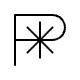 

### 説明
pop：スタックの最上位から値を1つ取り出して破棄します。

### Code
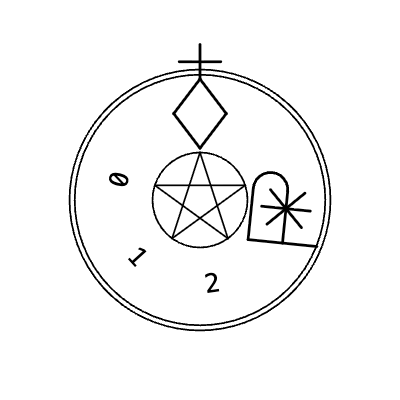 
```xml
<?xml version="1.0" encoding="UTF-8"?><MagicCircleLayout startRingId="0"><Rings><Ring id="0" type="MagicRing" x="0.00" y="0.00" angle="0.0000"><Comments></Comments><Items><Item type="sigil" value="RETURN" /><Item type="chars" value="10" /><Item type="sigil" value="pop" /><Item type="sigil" value="stack" /></Items></Ring></Rings><FieldItems></FieldItems></MagicCircleLayout>
```
```
10 pop stack
```

## exch
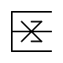 

### 説明
exch：スタックの最上位にある2つの値の順番を入れ替えます。

### Code
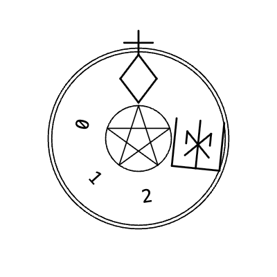 
```xml
<?xml version="1.0" encoding="UTF-8"?><MagicCircleLayout startRingId="0"><Rings><Ring id="0" type="MagicRing" x="0.00" y="0.00" angle="0.0000"><Comments></Comments><Items><Item type="sigil" value="RETURN" /><Item type="chars" value="1" /><Item type="chars" value="2" /><Item type="sigil" value="exch" /><Item type="sigil" value="print" /></Items></Ring></Rings><FieldItems></FieldItems></MagicCircleLayout>
```
```
1 2 exch print
```

## dup
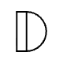 

### 説明
dup：スタックの最上位にある値をコピーして、スタックに積み直します。

### Code
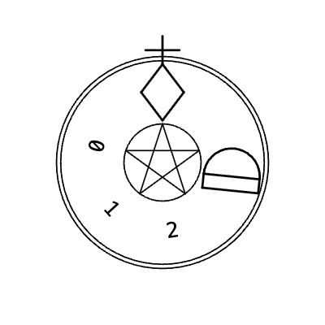 
```xml
<?xml version="1.0" encoding="UTF-8"?><MagicCircleLayout startRingId="0"><Rings><Ring id="0" type="MagicRing" x="0.00" y="0.00" angle="0.0000"><Comments></Comments><Items><Item type="sigil" value="RETURN" /><Item type="chars" value="99" /><Item type="sigil" value="dup" /><Item type="sigil" value="print" /></Items></Ring></Rings><FieldItems></FieldItems></MagicCircleLayout>
```
```
99 dup print
```

## copy
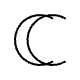 

### 説明
copy：スタックの上からn個の要素をコピーして、スタックに積み増します。

### Code
 
```xml
<?xml version="1.0" encoding="UTF-8"?><MagicCircleLayout startRingId="0"><Rings><Ring id="0" type="MagicRing" x="0.00" y="0.00" angle="0.0000"><Comments></Comments><Items><Item type="sigil" value="RETURN" /><Item type="chars" value="1" /><Item type="chars" value="2" /><Item type="chars" value="2" /><Item type="sigil" value="copy" /><Item type="sigil" value="stack" /></Items></Ring></Rings><FieldItems></FieldItems></MagicCircleLayout>
```
```
1 2 2 copy stack
```

## index
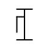 

### 説明
index：スタックの上からn番目の要素をコピーして、スタックの最上位に積みます。

### Code
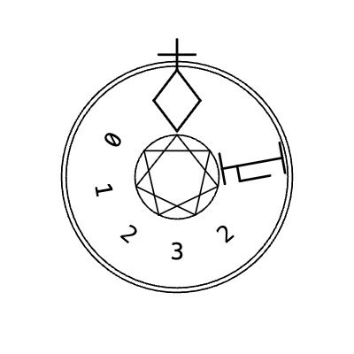 
```xml
<?xml version="1.0" encoding="UTF-8"?><MagicCircleLayout startRingId="0"><Rings><Ring id="0" type="MagicRing" x="0.00" y="0.00" angle="0.0000"><Comments></Comments><Items><Item type="sigil" value="RETURN" /><Item type="chars" value="10" /><Item type="chars" value="20" /><Item type="chars" value="1" /><Item type="sigil" value="index" /><Item type="sigil" value="print" /></Items></Ring></Rings><FieldItems></FieldItems></MagicCircleLayout>
```
```
10 20 1 index print
```

## roll
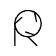 

### 説明
roll：スタックのn個の要素を、指定した回数だけ循環的に回転させます。

### Code
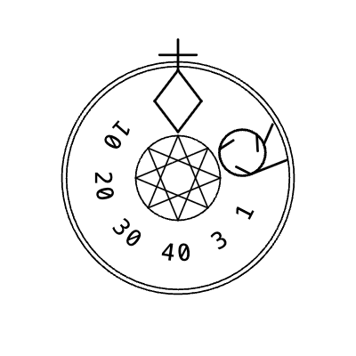 
```xml
<?xml version="1.0" encoding="UTF-8"?><MagicCircleLayout startRingId="0"><Rings><Ring id="0" type="MagicRing" x="0.00" y="0.00" angle="0.0000"><Comments></Comments><Items><Item type="sigil" value="RETURN" /><Item type="chars" value="1" /><Item type="chars" value="2" /><Item type="chars" value="3" /><Item type="chars" value="3" /><Item type="chars" value="1" /><Item type="sigil" value="roll" /><Item type="sigil" value="stack" /></Items></Ring></Rings><FieldItems></FieldItems></MagicCircleLayout>
```
```
1 2 3 3 1 roll stack
```

## add
 

### 説明
add：スタックから2つ値を取り出し、足し合わせたものをスタックに積みます。

### Code
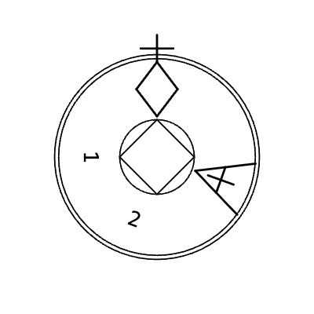 
```xml
<?xml version="1.0" encoding="UTF-8"?><MagicCircleLayout startRingId="0"><Rings><Ring id="0" type="MagicRing" x="0.00" y="0.00" angle="0.0000"><Comments></Comments><Items><Item type="sigil" value="RETURN" /><Item type="chars" value="1" /><Item type="chars" value="2" /><Item type="sigil" value="add" /><Item type="sigil" value="print" /></Items></Ring></Rings><FieldItems></FieldItems></MagicCircleLayout>
```
```
1 2 add print
```

## sub
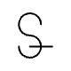 

### 説明
sub：スタックから2つ値を取り出し、引き算した結果をスタックに積みます。

### Code
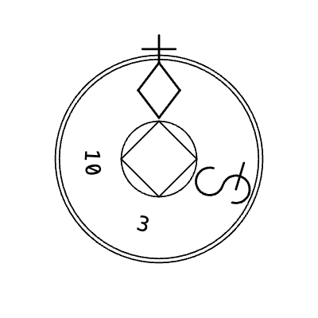 
```xml
<?xml version="1.0" encoding="UTF-8"?><MagicCircleLayout startRingId="0"><Rings><Ring id="0" type="MagicRing" x="0.00" y="0.00" angle="0.0000"><Comments></Comments><Items><Item type="sigil" value="RETURN" /><Item type="chars" value="10" /><Item type="chars" value="3" /><Item type="sigil" value="sub" /><Item type="sigil" value="print" /></Items></Ring></Rings><FieldItems></FieldItems></MagicCircleLayout>
```
```
10 3 sub print
```

## mul
 

### 説明
mul：スタックから2つ値を取り出し、掛け合わせた結果をスタックに積みます。

### Code
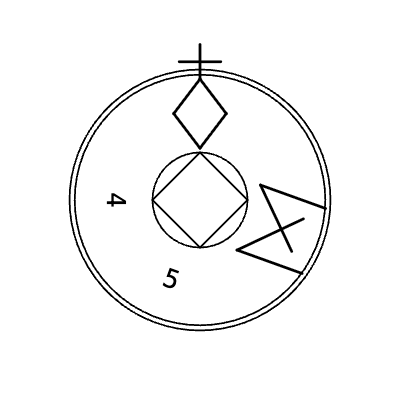 
```xml
<?xml version="1.0" encoding="UTF-8"?><MagicCircleLayout startRingId="0"><Rings><Ring id="0" type="MagicRing" x="0.00" y="0.00" angle="0.0000"><Comments></Comments><Items><Item type="sigil" value="RETURN" /><Item type="chars" value="4" /><Item type="chars" value="5" /><Item type="sigil" value="mul" /><Item type="sigil" value="print" /></Items></Ring></Rings><FieldItems></FieldItems></MagicCircleLayout>
```
```
4 5 mul print
```

## div
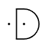 

### 説明
div：スタックから2つ値を取り出し、割り算した結果（実数）を積みます。

### Code
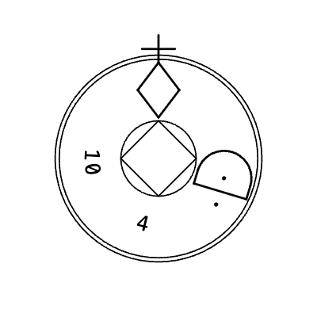 
```xml
<?xml version="1.0" encoding="UTF-8"?><MagicCircleLayout startRingId="0"><Rings><Ring id="0" type="MagicRing" x="0.00" y="0.00" angle="0.0000"><Comments></Comments><Items><Item type="sigil" value="RETURN" /><Item type="chars" value="10" /><Item type="chars" value="4" /><Item type="sigil" value="div" /><Item type="sigil" value="print" /></Items></Ring></Rings><FieldItems></FieldItems></MagicCircleLayout>
```
```
10 4 div print
```

## idiv
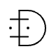 

### 説明
idiv：スタックから2つ値を取り出し、割り算の商（整数）を積みます。

### Code
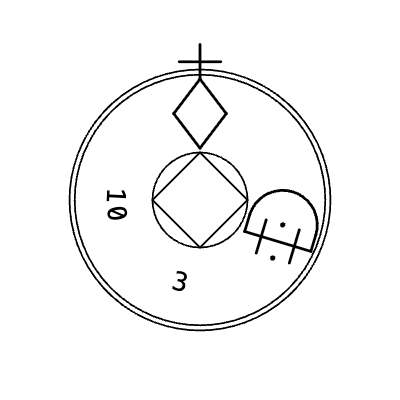 
```xml
<?xml version="1.0" encoding="UTF-8"?><MagicCircleLayout startRingId="0"><Rings><Ring id="0" type="MagicRing" x="0.00" y="0.00" angle="0.0000"><Comments></Comments><Items><Item type="sigil" value="RETURN" /><Item type="chars" value="10" /><Item type="chars" value="3" /><Item type="sigil" value="idiv" /><Item type="sigil" value="print" /></Items></Ring></Rings><FieldItems></FieldItems></MagicCircleLayout>
```
```
10 3 idiv print
```

## mod
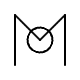 

### 説明
mod：スタックから2つ値を取り出し、割り算の余りをスタックに積みます。

### Code
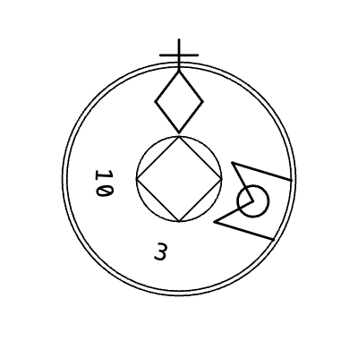 
```xml
<?xml version="1.0" encoding="UTF-8"?><MagicCircleLayout startRingId="0"><Rings><Ring id="0" type="MagicRing" x="0.00" y="0.00" angle="0.0000"><Comments></Comments><Items><Item type="sigil" value="RETURN" /><Item type="chars" value="10" /><Item type="chars" value="3" /><Item type="sigil" value="mod" /><Item type="sigil" value="print" /></Items></Ring></Rings><FieldItems></FieldItems></MagicCircleLayout>
```
```
10 3 mod print
```

## abs
 

### 説明
abs：スタックの最上位にある値の絶対値を計算して積みます。

### Code
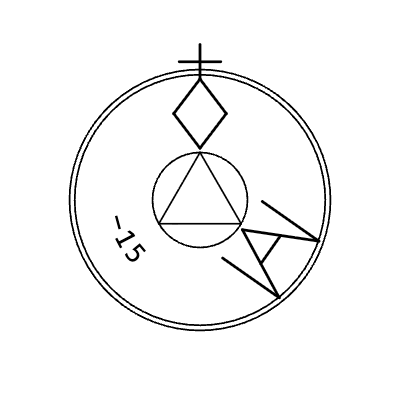 
```xml
<?xml version="1.0" encoding="UTF-8"?><MagicCircleLayout startRingId="0"><Rings><Ring id="0" type="MagicRing" x="0.00" y="0.00" angle="0.0000"><Comments></Comments><Items><Item type="sigil" value="RETURN" /><Item type="chars" value="-15" /><Item type="sigil" value="abs" /><Item type="sigil" value="print" /></Items></Ring></Rings><FieldItems></FieldItems></MagicCircleLayout>
```
```
-15 abs print
```

## neg
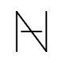 

### 説明
neg：スタックの最上位にある値の符号を反転させます。

### Code
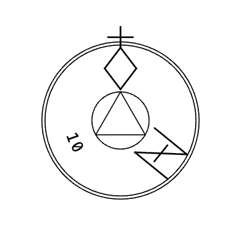 
```xml
<?xml version="1.0" encoding="UTF-8"?><MagicCircleLayout startRingId="0"><Rings><Ring id="0" type="MagicRing" x="0.00" y="0.00" angle="0.0000"><Comments></Comments><Items><Item type="sigil" value="RETURN" /><Item type="chars" value="10" /><Item type="sigil" value="neg" /><Item type="sigil" value="print" /></Items></Ring></Rings><FieldItems></FieldItems></MagicCircleLayout>
```
```
10 neg print
```

## sqrt
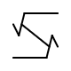 

### 説明
sqrt：スタックの最上位にある値の平方根を計算して積みます。

### Code
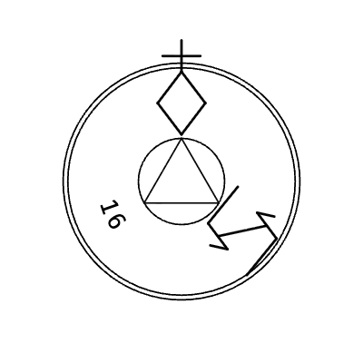 
```xml
<?xml version="1.0" encoding="UTF-8"?><MagicCircleLayout startRingId="0"><Rings><Ring id="0" type="MagicRing" x="0.00" y="0.00" angle="0.0000"><Comments></Comments><Items><Item type="sigil" value="RETURN" /><Item type="chars" value="16" /><Item type="sigil" value="sqrt" /><Item type="sigil" value="print" /></Items></Ring></Rings><FieldItems></FieldItems></MagicCircleLayout>
```
```
16 sqrt print
```

## atan
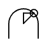 

### 説明
atan：2つの値から逆正接（アークタンジェント）を度数法で計算して積みます。

### Code
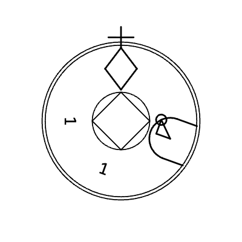 
```xml
<?xml version="1.0" encoding="UTF-8"?><MagicCircleLayout startRingId="0"><Rings><Ring id="0" type="MagicRing" x="0.00" y="0.00" angle="0.0000"><Comments></Comments><Items><Item type="sigil" value="RETURN" /><Item type="chars" value="1" /><Item type="chars" value="1" /><Item type="sigil" value="atan" /><Item type="sigil" value="print" /></Items></Ring></Rings><FieldItems></FieldItems></MagicCircleLayout>
```
```
1 1 atan print
```

## cos
 

### 説明
cos：角度（度数法）をスタックから取り出し、余弦（コサイン）を積みます。

### Code
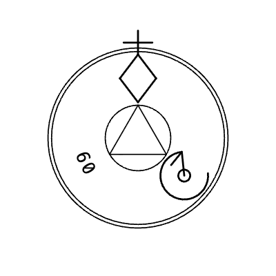 
```xml
<?xml version="1.0" encoding="UTF-8"?><MagicCircleLayout startRingId="0"><Rings><Ring id="0" type="MagicRing" x="0.00" y="0.00" angle="0.0000"><Comments></Comments><Items><Item type="sigil" value="RETURN" /><Item type="chars" value="60" /><Item type="sigil" value="cos" /><Item type="sigil" value="print" /></Items></Ring></Rings><FieldItems></FieldItems></MagicCircleLayout>
```
```
60 cos print
```

## sin
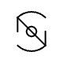 

### 説明
sin：角度（度数法）をスタックから取り出し、正弦（サイン）を積みます。

### Code
 
```xml
<?xml version="1.0" encoding="UTF-8"?><MagicCircleLayout startRingId="0"><Rings><Ring id="0" type="MagicRing" x="0.00" y="0.00" angle="0.0000"><Comments></Comments><Items><Item type="sigil" value="RETURN" /><Item type="chars" value="30" /><Item type="sigil" value="sin" /><Item type="sigil" value="print" /></Items></Ring></Rings><FieldItems></FieldItems></MagicCircleLayout>
```
```
30 sin print
```

## rand
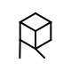 

### 説明
rand：0から最大値（2147483647）までの乱数を生成して積みます。

### Code
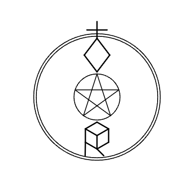 
```xml
<?xml version="1.0" encoding="UTF-8"?><MagicCircleLayout startRingId="0"><Rings><Ring id="0" type="MagicRing" x="0.00" y="0.00" angle="0.0000"><Comments></Comments><Items><Item type="sigil" value="RETURN" /><Item type="sigil" value="rand" /><Item type="sigil" value="print" /></Items></Ring></Rings><FieldItems></FieldItems></MagicCircleLayout>
```
```
rand print
```

## srand
 

### 説明
srand：乱数のシード値を設定します（現在の実装では未処理）。

### Code
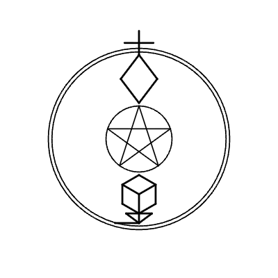 
```xml
<?xml version="1.0" encoding="UTF-8"?><MagicCircleLayout startRingId="0"><Rings><Ring id="0" type="MagicRing" x="0.00" y="0.00" angle="0.0000"><Comments></Comments><Items><Item type="sigil" value="RETURN" /><Item type="chars" value="12345" /><Item type="sigil" value="srand" /></Items></Ring></Rings><FieldItems></FieldItems></MagicCircleLayout>
```
```
12345 srand
```

## rrand
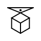 

### 説明
rrand：乱数のシードを現在時刻等で初期化します（現在の実装では未処理）。

### Code
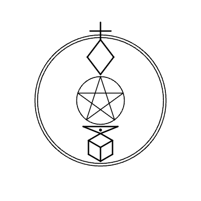 
```xml
<?xml version="1.0" encoding="UTF-8"?><MagicCircleLayout startRingId="0"><Rings><Ring id="0" type="MagicRing" x="0.00" y="0.00" angle="0.0000"><Comments></Comments><Items><Item type="sigil" value="RETURN" /><Item type="sigil" value="rrand" /></Items></Ring></Rings><FieldItems></FieldItems></MagicCircleLayout>
```
```
rrand
```

## length
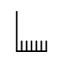 

### 説明
length：配列、辞書、または文字列の要素数（長さ）をスタックに積みます。

### Code
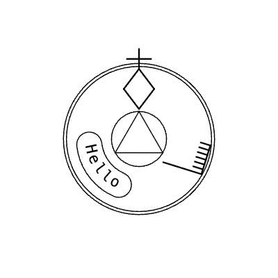 
```xml
<?xml version="1.0" encoding="UTF-8"?><MagicCircleLayout startRingId="0"><Rings><Ring id="0" type="MagicRing" x="0.00" y="0.00" angle="0.0000"><Comments></Comments><Items><Item type="sigil" value="RETURN" /><Item type="chars" value="(hello)" /><Item type="sigil" value="length" /><Item type="sigil" value="print" /></Items></Ring></Rings><FieldItems></FieldItems></MagicCircleLayout>
```
```
(hello) length print
```

## get
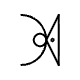 

### 説明
get：配列や辞書から、指定したインデックスやキーに対応する値を取り出します。

### Code
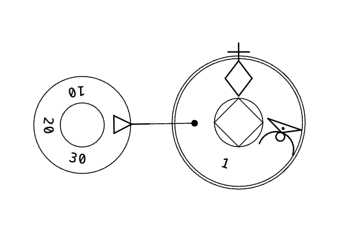 
```xml
<?xml version="1.0" encoding="UTF-8"?><MagicCircleLayout startRingId="0"><Rings><Ring id="0" type="MagicRing" x="0.00" y="0.00" angle="0.0000"><Comments></Comments><Items><Item type="sigil" value="RETURN" /><Item type="chars" value="[10 20 30]" /><Item type="chars" value="1" /><Item type="sigil" value="get" /><Item type="sigil" value="print" /></Items></Ring></Rings><FieldItems></FieldItems></MagicCircleLayout>
```
```
[10 20 30] 1 get print
```

## put
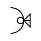 

### 説明
put：配列や辞書、文字列の指定した位置に、新しい値を書き込みます。

### Code
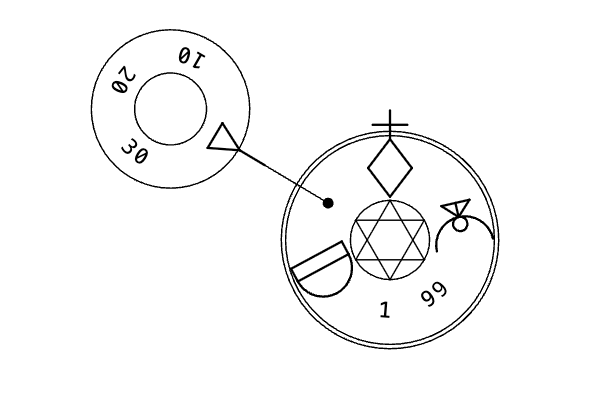 
```xml
<?xml version="1.0" encoding="UTF-8"?><MagicCircleLayout startRingId="0"><Rings><Ring id="0" type="MagicRing" x="0.00" y="0.00" angle="0.0000"><Comments></Comments><Items><Item type="sigil" value="RETURN" /><Item type="chars" value="[10 20 30]" /><Item type="chars" value="1" /><Item type="chars" value="99" /><Item type="sigil" value="put" /><Item type="sigil" value="stack" /></Items></Ring></Rings><FieldItems></FieldItems></MagicCircleLayout>
```
```
[10 20 30] 1 99 put stack
```

## string
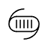 

### 説明
string：指定した長さの空の文字列オブジェクトを作成して積みます。

### Code
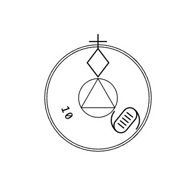 
```xml
<?xml version="1.0" encoding="UTF-8"?><MagicCircleLayout startRingId="0"><Rings><Ring id="0" type="MagicRing" x="0.00" y="0.00" angle="0.0000"><Comments></Comments><Items><Item type="sigil" value="RETURN" /><Item type="chars" value="10" /><Item type="sigil" value="string" /><Item type="sigil" value="print" /></Items></Ring></Rings><FieldItems></FieldItems></MagicCircleLayout>
```
```
10 string print
```

## cvi
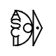 

### 説明
cvi：文字列の最初の文字を、その文字コード（整数）に変換して積みます。

### Code
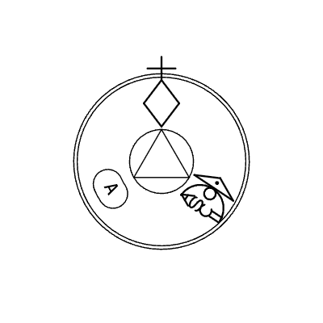 
```xml
<?xml version="1.0" encoding="UTF-8"?><MagicCircleLayout startRingId="0"><Rings><Ring id="0" type="MagicRing" x="0.00" y="0.00" angle="0.0000"><Comments></Comments><Items><Item type="sigil" value="RETURN" /><Item type="chars" value="(A)" /><Item type="sigil" value="cvi" /><Item type="sigil" value="print" /></Items></Ring></Rings><FieldItems></FieldItems></MagicCircleLayout>
```
```
(A) cvi print
```

## chr
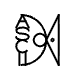 

### 説明
chr：整数（文字コード）を、対応する1文字の文字列に変換して積みます。

### Code
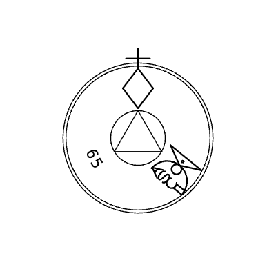 
```xml
<?xml version="1.0" encoding="UTF-8"?><MagicCircleLayout startRingId="0"><Rings><Ring id="0" type="MagicRing" x="0.00" y="0.00" angle="0.0000"><Comments></Comments><Items><Item type="sigil" value="RETURN" /><Item type="chars" value="65" /><Item type="sigil" value="chr" /><Item type="sigil" value="print" /></Items></Ring></Rings><FieldItems></FieldItems></MagicCircleLayout>
```
```
65 chr print
```

## getinterval
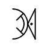 

### 説明
getinterval：配列や文字列から、指定範囲の部分配列・文字列を抽出します。

### Code
 
```xml
<?xml version="1.0" encoding="UTF-8"?><MagicCircleLayout startRingId="0"><Rings><Ring id="0" type="MagicRing" x="0.00" y="0.00" angle="0.0000"><Comments></Comments><Items><Item type="sigil" value="RETURN" /><Item type="chars" value="(abcdef)" /><Item type="chars" value="1" /><Item type="chars" value="3" /><Item type="sigil" value="getinterval" /><Item type="sigil" value="print" /></Items></Ring></Rings><FieldItems></FieldItems></MagicCircleLayout>
```
```
(abcdef) 1 3 getinterval print
```

## putinterval
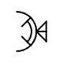 

### 説明
putinterval：配列や文字列の指定位置に、別の配列や文字列の内容を上書きします。

### Code
 
```xml
<?xml version="1.0" encoding="UTF-8"?><MagicCircleLayout startRingId="0"><Rings><Ring id="0" type="MagicRing" x="0.00" y="0.00" angle="0.0000"><Comments></Comments><Items><Item type="sigil" value="RETURN" /><Item type="chars" value="(abcdef)" /><Item type="chars" value="1" /><Item type="chars" value="(XYZ)" /><Item type="sigil" value="putinterval" /><Item type="sigil" value="print" /></Items></Ring></Rings><FieldItems></FieldItems></MagicCircleLayout>
```
```
(abcdef) 1 (XYZ) putinterval print
```

## array
 

### 説明
array：指定した要素数を持つ、空の配列オブジェクトを作成して積みます。

### Code
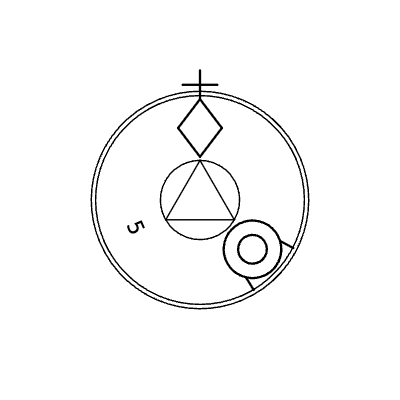 
```xml
<?xml version="1.0" encoding="UTF-8"?><MagicCircleLayout startRingId="0"><Rings><Ring id="0" type="MagicRing" x="0.00" y="0.00" angle="0.0000"><Comments></Comments><Items><Item type="sigil" value="RETURN" /><Item type="chars" value="5" /><Item type="sigil" value="array" /><Item type="sigil" value="print" /></Items></Ring></Rings><FieldItems></FieldItems></MagicCircleLayout>
```
```
5 array print
```

## forall
 

### 説明
forall：配列や辞書の各要素に対して、指定した手続きを繰り返し実行します。

### Code
 
```xml
<?xml version="1.0" encoding="UTF-8"?><MagicCircleLayout startRingId="0"><Rings><Ring id="0" type="MagicRing" x="0.00" y="0.00" angle="0.0000"><Comments></Comments><Items><Item type="sigil" value="RETURN" /><Item type="chars" value="[1 2 3]" /><Item type="chars" value="{ print }" /><Item type="sigil" value="forall" /></Items></Ring></Rings><FieldItems></FieldItems></MagicCircleLayout>
```
```
[1 2 3] { print } forall
```

## dict
 

### 説明
dict：新しい空の辞書（連想配列）を作成してスタックに積みます。

### Code
 
```xml
<?xml version="1.0" encoding="UTF-8"?><MagicCircleLayout startRingId="0"><Rings><Ring id="0" type="MagicRing" x="0.00" y="0.00" angle="0.0000"><Comments></Comments><Items><Item type="sigil" value="RETURN" /><Item type="chars" value="10" /><Item type="sigil" value="dict" /><Item type="sigil" value="print" /></Items></Ring></Rings><FieldItems></FieldItems></MagicCircleLayout>
```
```
10 dict print
```

## begin
 

### 説明
begin：辞書を辞書スタックに積み、以降の変数定義や検索の対象にします。

### Code
 
```xml
<?xml version="1.0" encoding="UTF-8"?><MagicCircleLayout startRingId="0"><Rings><Ring id="0" type="MagicRing" x="0.00" y="0.00" angle="0.0000"><Comments></Comments><Items><Item type="sigil" value="RETURN" /><Item type="chars" value="10" /><Item type="sigil" value="dict" /><Item type="sigil" value="begin" /></Items></Ring></Rings><FieldItems></FieldItems></MagicCircleLayout>
```
```
10 dict begin
```

## end
 

### 説明
end：現在アクティブな辞書を辞書スタックから取り除きます。

### Code
 
```xml
<?xml version="1.0" encoding="UTF-8"?><MagicCircleLayout startRingId="0"><Rings><Ring id="0" type="MagicRing" x="0.00" y="0.00" angle="0.0000"><Comments></Comments><Items><Item type="sigil" value="RETURN" /><Item type="sigil" value="end" /></Items></Ring></Rings><FieldItems></FieldItems></MagicCircleLayout>
```
```
end
```

## def
 

### 説明
def：現在の辞書に、名前と値を対応付けて変数を定義します。

### Code
 
```xml
<?xml version="1.0" encoding="UTF-8"?><MagicCircleLayout startRingId="0"><Rings><Ring id="0" type="MagicRing" x="0.00" y="0.00" angle="0.0000"><Comments></Comments><Items><Item type="sigil" value="RETURN" /><Item type="chars" value="/x" /><Item type="chars" value="100" /><Item type="sigil" value="def" /></Items></Ring></Rings><FieldItems></FieldItems></MagicCircleLayout>
```
```
/x 100 def
```

## eq
 

### 説明
eq：スタックの2つの値が等しければtrue、そうでなければfalseを積みます。

### Code
 
```xml
<?xml version="1.0" encoding="UTF-8"?><MagicCircleLayout startRingId="0"><Rings><Ring id="0" type="MagicRing" x="0.00" y="0.00" angle="0.0000"><Comments></Comments><Items><Item type="sigil" value="RETURN" /><Item type="chars" value="5" /><Item type="chars" value="5" /><Item type="sigil" value="eq" /><Item type="sigil" value="print" /></Items></Ring></Rings><FieldItems></FieldItems></MagicCircleLayout>
```
```
5 5 eq print
```

## ne
 

### 説明
ne：スタックの2つの値が等しくなければtrue、等しければfalseを積みます。

### Code
 
```xml
<?xml version="1.0" encoding="UTF-8"?><MagicCircleLayout startRingId="0"><Rings><Ring id="0" type="MagicRing" x="0.00" y="0.00" angle="0.0000"><Comments></Comments><Items><Item type="sigil" value="RETURN" /><Item type="chars" value="5" /><Item type="chars" value="10" /><Item type="sigil" value="ne" /><Item type="sigil" value="print" /></Items></Ring></Rings><FieldItems></FieldItems></MagicCircleLayout>
```
```
5 10 ne print
```

## ge
 

### 説明
ge：1つ目の値が2つ目の値以上であればtrueをスタックに積みます。

### Code
 
```xml
<?xml version="1.0" encoding="UTF-8"?><MagicCircleLayout startRingId="0"><Rings><Ring id="0" type="MagicRing" x="0.00" y="0.00" angle="0.0000"><Comments></Comments><Items><Item type="sigil" value="RETURN" /><Item type="chars" value="10" /><Item type="chars" value="5" /><Item type="sigil" value="ge" /><Item type="sigil" value="print" /></Items></Ring></Rings><FieldItems></FieldItems></MagicCircleLayout>
```
```
10 5 ge print
```

## gt
 

### 説明
gt：1つ目の値が2つ目の値より大きければtrueをスタックに積みます。

### Code
 
```xml
<?xml version="1.0" encoding="UTF-8"?><MagicCircleLayout startRingId="0"><Rings><Ring id="0" type="MagicRing" x="0.00" y="0.00" angle="0.0000"><Comments></Comments><Items><Item type="sigil" value="RETURN" /><Item type="chars" value="10" /><Item type="chars" value="5" /><Item type="sigil" value="gt" /><Item type="sigil" value="print" /></Items></Ring></Rings><FieldItems></FieldItems></MagicCircleLayout>
```
```
10 5 gt print
```

## le
 

### 説明
le：1つ目の値が2つ目の値以下であればtrueをスタックに積みます。

### Code
 
```xml
<?xml version="1.0" encoding="UTF-8"?><MagicCircleLayout startRingId="0"><Rings><Ring id="0" type="MagicRing" x="0.00" y="0.00" angle="0.0000"><Comments></Comments><Items><Item type="sigil" value="RETURN" /><Item type="chars" value="5" /><Item type="chars" value="10" /><Item type="sigil" value="le" /><Item type="sigil" value="print" /></Items></Ring></Rings><FieldItems></FieldItems></MagicCircleLayout>
```
```
5 10 le print
```

## lt
 

### 説明
lt：1つ目の値が2つ目の値より小さければtrueをスタックに積みます。

### Code
 
```xml
<?xml version="1.0" encoding="UTF-8"?><MagicCircleLayout startRingId="0"><Rings><Ring id="0" type="MagicRing" x="0.00" y="0.00" angle="0.0000"><Comments></Comments><Items><Item type="sigil" value="RETURN" /><Item type="chars" value="5" /><Item type="chars" value="10" /><Item type="sigil" value="lt" /><Item type="sigil" value="print" /></Items></Ring></Rings><FieldItems></FieldItems></MagicCircleLayout>
```
```
5 10 lt print
```

## and
 

### 説明
and：2つの論理値の論理積（AND）を計算してスタックに積みます。

### Code
 
```xml
<?xml version="1.0" encoding="UTF-8"?><MagicCircleLayout startRingId="0"><Rings><Ring id="0" type="MagicRing" x="0.00" y="0.00" angle="0.0000"><Comments></Comments><Items><Item type="sigil" value="RETURN" /><Item type="sigil" value="true" /><Item type="sigil" value="false" /><Item type="sigil" value="and" /><Item type="sigil" value="print" /></Items></Ring></Rings><FieldItems></FieldItems></MagicCircleLayout>
```
```
true false and print
```

## or
 

### 説明
or：2つの論理値の論理和（OR）を計算してスタックに積みます。

### Code
 
```xml
<?xml version="1.0" encoding="UTF-8"?><MagicCircleLayout startRingId="0"><Rings><Ring id="0" type="MagicRing" x="0.00" y="0.00" angle="0.0000"><Comments></Comments><Items><Item type="sigil" value="RETURN" /><Item type="sigil" value="true" /><Item type="sigil" value="false" /><Item type="sigil" value="or" /><Item type="sigil" value="print" /></Items></Ring></Rings><FieldItems></FieldItems></MagicCircleLayout>
```
```
true false or print
```

## xor
 

### 説明
xor：2つの論理値の排他的論理和（XOR）を計算して積みます。

### Code
 
```xml
<?xml version="1.0" encoding="UTF-8"?><MagicCircleLayout startRingId="0"><Rings><Ring id="0" type="MagicRing" x="0.00" y="0.00" angle="0.0000"><Comments></Comments><Items><Item type="sigil" value="RETURN" /><Item type="sigil" value="true" /><Item type="sigil" value="false" /><Item type="sigil" value="xor" /><Item type="sigil" value="print" /></Items></Ring></Rings><FieldItems></FieldItems></MagicCircleLayout>
```
```
true false xor print
```

## not
 

### 説明
not：スタック最上位の論理値を反転（真偽を逆に）させます。

### Code
 
```xml
<?xml version="1.0" encoding="UTF-8"?><MagicCircleLayout startRingId="0"><Rings><Ring id="0" type="MagicRing" x="0.00" y="0.00" angle="0.0000"><Comments></Comments><Items><Item type="sigil" value="RETURN" /><Item type="sigil" value="true" /><Item type="sigil" value="not" /><Item type="sigil" value="print" /></Items></Ring></Rings><FieldItems></FieldItems></MagicCircleLayout>
```
```
true not print
```

## true
 

### 説明
true：論理値の真（true）をスタックに積みます。

### Code
 
```xml
<?xml version="1.0" encoding="UTF-8"?><MagicCircleLayout startRingId="0"><Rings><Ring id="0" type="MagicRing" x="0.00" y="0.00" angle="0.0000"><Comments></Comments><Items><Item type="sigil" value="RETURN" /><Item type="sigil" value="true" /><Item type="sigil" value="print" /></Items></Ring></Rings><FieldItems></FieldItems></MagicCircleLayout>
```
```
true print
```

## false
 

### 説明
false：論理値の偽（false）をスタックに積みます。

### Code
 
```xml
<?xml version="1.0" encoding="UTF-8"?><MagicCircleLayout startRingId="0"><Rings><Ring id="0" type="MagicRing" x="0.00" y="0.00" angle="0.0000"><Comments></Comments><Items><Item type="sigil" value="RETURN" /><Item type="sigil" value="false" /><Item type="sigil" value="print" /></Items></Ring></Rings><FieldItems></FieldItems></MagicCircleLayout>
```
```
false print
```

## null
 

### 説明
null：null値をスタックに積みます。

### Code
 
```xml
<?xml version="1.0" encoding="UTF-8"?><MagicCircleLayout startRingId="0"><Rings><Ring id="0" type="MagicRing" x="0.00" y="0.00" angle="0.0000"><Comments></Comments><Items><Item type="sigil" value="RETURN" /><Item type="sigil" value="null" /><Item type="sigil" value="print" /></Items></Ring></Rings><FieldItems></FieldItems></MagicCircleLayout>
```
```
null print
```

## exec
 

### 説明
exec：スタックにある手続き（プログラムの塊）を実行します。

### Code
 
```xml
<?xml version="1.0" encoding="UTF-8"?><MagicCircleLayout startRingId="0"><Rings><Ring id="0" type="MagicRing" x="0.00" y="0.00" angle="0.0000"><Comments></Comments><Items><Item type="sigil" value="RETURN" /><Item type="chars" value="{ 1 2 add print }" /><Item type="sigil" value="exec" /></Items></Ring></Rings><FieldItems></FieldItems></MagicCircleLayout>
```
```
{ 1 2 add print } exec
```

## if
 

### 説明
if：条件が真の場合に、指定した手続きを実行します。

### Code
 
```xml
<?xml version="1.0" encoding="UTF-8"?><MagicCircleLayout startRingId="0"><Rings><Ring id="0" type="MagicRing" x="0.00" y="0.00" angle="0.0000"><Comments></Comments><Items><Item type="sigil" value="RETURN" /><Item type="sigil" value="true" /><Item type="chars" value="{ 100 print }" /><Item type="sigil" value="if" /></Items></Ring></Rings><FieldItems></FieldItems></MagicCircleLayout>
```
```
true { 100 print } if
```

## ifelse
 

### 説明
ifelse：条件に応じて、実行する2つの手続きを切り替えます。

### Code
 
```xml
<?xml version="1.0" encoding="UTF-8"?><MagicCircleLayout startRingId="0"><Rings><Ring id="0" type="MagicRing" x="0.00" y="0.00" angle="0.0000"><Comments></Comments><Items><Item type="sigil" value="RETURN" /><Item type="sigil" value="true" /><Item type="chars" value="{ 1 print }" /><Item type="chars" value="{ 2 print }" /><Item type="sigil" value="ifelse" /></Items></Ring></Rings><FieldItems></FieldItems></MagicCircleLayout>
```
```
true { 1 print } { 2 print } ifelse
```

## repeat
 

### 説明
repeat：指定した回数だけ、手続きを繰り返し実行します。

### Code
 
```xml
<?xml version="1.0" encoding="UTF-8"?><MagicCircleLayout startRingId="0"><Rings><Ring id="0" type="MagicRing" x="0.00" y="0.00" angle="0.0000"><Comments></Comments><Items><Item type="sigil" value="RETURN" /><Item type="chars" value="3" /><Item type="chars" value="{ 1 print }" /><Item type="sigil" value="repeat" /></Items></Ring></Rings><FieldItems></FieldItems></MagicCircleLayout>
```
```
3 { 1 print } repeat
```

## for
 

### 説明
for：開始、増分、終了値を指定して、数値を変化させながら手続きを繰り返します。

### Code
 
```xml
<?xml version="1.0" encoding="UTF-8"?><MagicCircleLayout startRingId="0"><Rings><Ring id="0" type="MagicRing" x="0.00" y="0.00" angle="0.0000"><Comments></Comments><Items><Item type="sigil" value="RETURN" /><Item type="chars" value="1" /><Item type="chars" value="1" /><Item type="chars" value="5" /><Item type="chars" value="{ print }" /><Item type="sigil" value="for" /></Items></Ring></Rings><FieldItems></FieldItems></MagicCircleLayout>
```
```
1 1 5 { print } for
```

## loop
 

### 説明
loop：exitが呼ばれるまで、手続きを無限に繰り返し実行します。

### Code
 
```xml
<?xml version="1.0" encoding="UTF-8"?><MagicCircleLayout startRingId="0"><Rings><Ring id="0" type="MagicRing" x="0.00" y="0.00" angle="0.0000"><Comments></Comments><Items><Item type="sigil" value="RETURN" /><Item type="chars" value="{ 1 print exit }" /><Item type="sigil" value="loop" /></Items></Ring></Rings><FieldItems></FieldItems></MagicCircleLayout>
```
```
{ 1 print exit } loop
```

## exit
 

### 説明
exit：実行中のloop（繰り返し）から即座に脱出します。

### Code
 
```xml
<?xml version="1.0" encoding="UTF-8"?><MagicCircleLayout startRingId="0"><Rings><Ring id="0" type="MagicRing" x="0.00" y="0.00" angle="0.0000"><Comments></Comments><Items><Item type="sigil" value="RETURN" /><Item type="chars" value="{ exit }" /><Item type="sigil" value="loop" /></Items></Ring></Rings><FieldItems></FieldItems></MagicCircleLayout>
```
```
{ exit } loop
```

## magicactivate
 

### 説明
magicactivate：指定したデータを魔法としてUnity側に送信し実行します。

### Code
 
```xml
<?xml version="1.0" encoding="UTF-8"?><MagicCircleLayout startRingId="0"><Rings><Ring id="0" type="MagicRing" x="0.00" y="0.00" angle="0.0000"><Comments></Comments><Items><Item type="sigil" value="RETURN" /><Item type="chars" value="(fire)" /><Item type="sigil" value="magicactivate" /></Items></Ring></Rings><FieldItems></FieldItems></MagicCircleLayout>
```
```
(fire) magicactivate
```

## spawnobj
 

### 説明
spawnobj：指定したパラメータでUnity上に新しいオブジェクトを生成します。

### Code
 
```xml
<?xml version="1.0" encoding="UTF-8"?><MagicCircleLayout startRingId="0"><Rings><Ring id="0" type="MagicRing" x="0.00" y="0.00" angle="0.0000"><Comments></Comments><Items><Item type="sigil" value="RETURN" /><Item type="chars" value="(bullet)" /><Item type="sigil" value="spawnobj" /></Items></Ring></Rings><FieldItems></FieldItems></MagicCircleLayout>
```
```
(bullet) spawnobj
```

## transform
 

### 説明
transform：Unityオブジェクトの位置、回転、スケールを変更します。

### Code
 
```xml
<?xml version="1.0" encoding="UTF-8"?><MagicCircleLayout startRingId="0"><Rings><Ring id="0" type="MagicRing" x="0.00" y="0.00" angle="0.0000"><Comments></Comments><Items><Item type="sigil" value="RETURN" /><Item type="chars" value="0" /><Item type="chars" value="10" /><Item type="chars" value="0" /><Item type="sigil" value="transform" /></Items></Ring></Rings><FieldItems></FieldItems></MagicCircleLayout>
```
```
0 10 0 transform
```

## attachtoparent
 

### 説明
attachtoparent：Unityオブジェクトを別のオブジェクトの子要素にします。

### Code
 
```xml
<?xml version="1.0" encoding="UTF-8"?><MagicCircleLayout startRingId="0"><Rings><Ring id="0" type="MagicRing" x="0.00" y="0.00" angle="0.0000"><Comments></Comments><Items><Item type="sigil" value="RETURN" /><Item type="sigil" value="attachtoparent" /></Items></Ring></Rings><FieldItems></FieldItems></MagicCircleLayout>
```
```
attachtoparent
```

## animation
 

### 説明
animation：Unityオブジェクトに対して、指定したアニメーションを再生します。

### Code
 
```xml
<?xml version="1.0" encoding="UTF-8"?><MagicCircleLayout startRingId="0"><Rings><Ring id="0" type="MagicRing" x="0.00" y="0.00" angle="0.0000"><Comments></Comments><Items><Item type="sigil" value="RETURN" /><Item type="chars" value="(play_anim)" /><Item type="sigil" value="animation" /></Items></Ring></Rings><FieldItems></FieldItems></MagicCircleLayout>
```
```
(play_anim) animation
```

## print
 

### 説明
print：スタックの値を1つ取り出し、出力ログに表示します。

### Code
 
```xml
<?xml version="1.0" encoding="UTF-8"?><MagicCircleLayout startRingId="0"><Rings><Ring id="0" type="MagicRing" x="0.00" y="0.00" angle="0.0000"><Comments></Comments><Items><Item type="sigil" value="RETURN" /><Item type="chars" value="(Hello)" /><Item type="sigil" value="print" /></Items></Ring></Rings><FieldItems></FieldItems></MagicCircleLayout>
```
```
(Hello) print
```

## stack
 

### 説明
stack：現在のスタックの内容をすべて出力ログに表示します。

### Code
 
```xml
<?xml version="1.0" encoding="UTF-8"?><MagicCircleLayout startRingId="0"><Rings><Ring id="0" type="MagicRing" x="0.00" y="0.00" angle="0.0000"><Comments></Comments><Items><Item type="sigil" value="RETURN" /><Item type="chars" value="1" /><Item type="chars" value="2" /><Item type="chars" value="3" /><Item type="sigil" value="stack" /></Items></Ring></Rings><FieldItems></FieldItems></MagicCircleLayout>
```
```
1 2 3 stack
```
